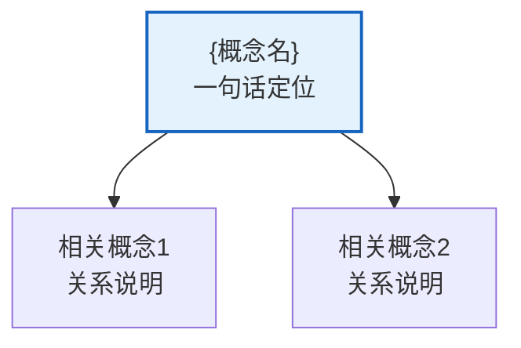

# {概念名}

> [!abstract] 概述
> 2-4 句话说明含义与定位，包含 ==高亮术语==。

## 定义

> [!def] 定义
> …

## 核心性质

| 性质 | 说明 | 备注 |
|---|---|---|

## 关系网络

- [[相关概念1]]：关系一句话说明

## 章节扩展

### 第{N}章：{章标题}

- 要点1
- 要点2

## 补充

> [!info] 来源
> 作者（年份）+ URL

## 参见

- [[{概念X}]] — 为什么相关

