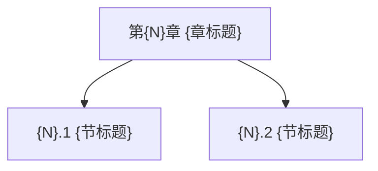

> [!abstract] 本章一句话
> 用 ==高亮== 写出本章主线。

## 全章知识框架



## 各节要点（建议用嵌入聚合）

- ![[{N}.1 {节标题}#^overview]]
- ![[{N}.2 {节标题}#^overview]]

## 本章概念清单（可选：用 Dataview 自动列出）

```dataview
LIST FROM "Content/{学科}/concepts"
SORT file.mtime desc
```

## 跨章关联

- [[{跨章概念}]]：为什么关联？

## 复习题 / 自测

- Q1：…
- Q2：…

## 本章索引

- 节笔记：[[{N}.1 {节标题}]]、[[{N}.2 {节标题}]]
- 概念页：[[{概念A}]]、[[{概念B}]]
- 对比页：[[{A}-vs-{B}]]

#学习/{学科}/第{N}章
