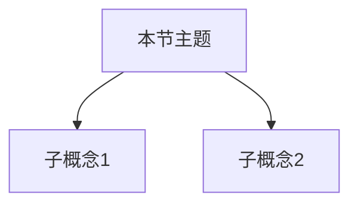

**相关笔记：** [[{前节}]] | [[{后节}]]

> [!abstract] 概览
> ==核心术语==：…
> - 要点1
> - 要点2
> - 要点3
> - 要点4

## 核心思想

> [!def] 定义
> …

> [!tip] 关键方法/直觉
> …

> [!example] 示例
> …

## 补充理解（至少 2 条）

> [!info] 扩展阅读
> 作者（年份）：标题  
> URL：…

## 易混淆点（至少 2 条）

> [!warning] 易错点
> ❌ 错误理解：…  
> ✅ 正确理解：…

## 习题概览

| 题号 | 核心考点 | 难度 | 备注 |
|---|---|---|---|

## 视频资源（可选）

| 标题 | 链接 | 时长 | 备注 |
|---|---|---|---|

## 参见 Wiki

- [[{概念1}]]
- [[{概念2}]]

#学习/{学科}/{子领域}

