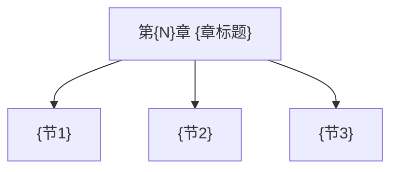

# 第{N}章 {章标题} — 章节汇总

> [!abstract] 本章你应该掌握
> - =={核心主题1}==：{一句话}
> - =={核心主题2}==：{一句话}
> - 复习目标：{能独立解决哪些典型问题}

---

## 本章知识框架

---

## 各节索引
- [[{节1文件名}|{节1显示名}]]
- [[{节2文件名}|{节2显示名}]]
- [[{节3文件名}|{节3显示名}]]

---

## 关键结论 / 模板总结
1. {结论/模板 1}
2. {结论/模板 2}

---

## 易混淆点（对比入口）
- [[{A}-vs-{B}|{A} vs {B}]]

---

## 本章 Wiki 贡献（Ingest 产物）
- Concepts：
  - [[{概念1}]]
  - [[{概念2}]]
- Theorems / Properties：
  - [[{性质1}]]
- Queries：
  - [[{问题1}]]

