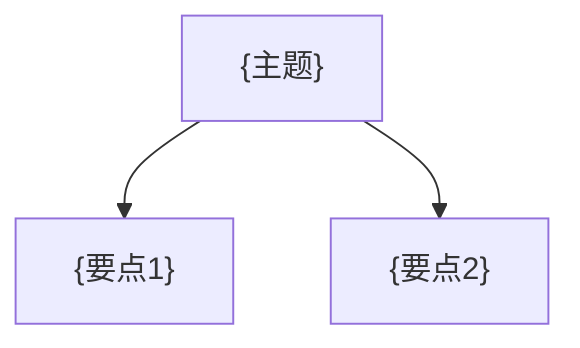

# {节号} {节标题}

> [!abstract] 概览
> - =={核心术语1}==：{一句话解释}
> - =={核心术语2}==：{一句话解释}
> - 本节目标：{你学完要会什么}

## 相关笔记
- 上一节：[[{上一节文件名}|{上一节显示名}]]
- 下一节：[[{下一节文件名}|{下一节显示名}]]

---

## 知识结构图


---

## 核心内容

> [!def] 定义 / 不变式 / 状态
> {写出形式化定义（复杂度、状态定义、不变式、接口契约等）}

> [!tip] 套路 / 模板
> {总结可复用套路：怎么想、怎么做、常见变体}

> [!example] 例题 / 代码
> {给出例题描述、关键思路、或代码片段}

```cpp
// {可运行/可复用的代码片段}
```

> [!warning] 坑点 / 易错点
> - ❌ {常见错误}
> - ✅ {正确做法}

> [!info] 扩展 / 参考
> - 来源：{作者/年份/URL}
> - 变体：{相关变体}

---

## 参见 Wiki
- [[{概念1}]]
- [[{概念2}]]

