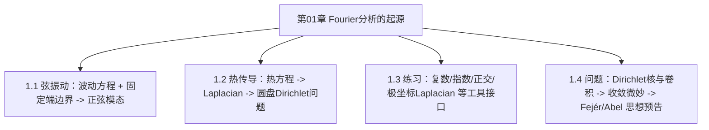

# 第01章 Fourier分析的起源 — 章节汇总

> [!abstract] 本章一句话
> 用两个最经典的物理模型（弦振动/热传导）把 Fourier 分析“逼出来”：**PDE + 边界条件** 导致 **离散正交模态**，而“部分和=卷积”把研究重心从表示推进到收敛与核方法。

^overview

## 全章知识框架

## 各节要点（嵌入聚合）

- ![[1.1 弦振动#^overview]]
- ![[1.2 热传导方程#^overview]]
- ![[1.3 练习#^overview]]
- ![[1.4 问题#^overview]]

> [!faq]- 完备证明索引（第01章）
> - PDE 表示（分离变量与边界条件）
>   - [[1.1 弦振动#^pf-1-1-wave-modes|1.1 固定端波动方程的模态分解（正弦级数）]]
>   - [[1.2 热传导方程#^pf-1-2-heat-derivation|1.2 守恒律 + Fourier 定律 ⇒ 热方程；稳态 ⇒ Laplace]]
>   - [[1.2 热传导方程#^pf-1-2-disk-dirichlet|1.2 圆盘 Dirichlet：分离变量 + Fourier 边界展开]]
> - 工具接口（复指数/坐标适配）
>   - [[1.3 练习#^pf-1-3-euler|1.3 Euler 公式（幂级数偶奇拆分）]]
>   - [[1.3 练习#^pf-1-3-polar-laplacian|1.3 二维极坐标 Laplacian 公式]]
> - 核与收敛预告（从表示转向逼近）
>   - [[1.4 问题#^pf-1-4-sn-conv-dn|1.4 $S_N f=f*D_N$（部分和=卷积）]]
>   - [[1.4 问题#^pf-1-4-dirichlet-not-good|1.4 Dirichlet 核非好核（$L^1$ 对数下界）]]
>   - [[1.4 问题#^pf-1-4-fejer-poisson-good|1.4 Fejér/Poisson 核满足好核三性质（去重版）]]
## 跨节主线（复习抓手）
1) **从 PDE 到 Fourier**：边界条件把允许的空间形状离散化（谱/正交基），初值决定系数。  
2) **从表示到收敛**：一旦出现“部分和”，收敛与逼近就变成主问题；核方法提供统一语言。  
3) **从坏核到好核**：Dirichlet 核不稳定 → 需要平均（Fejér）或权重（Abel/Poisson）来“修正求和”。

## 复习题 / 自测（章级）
1) 用一句话对比波动方程与热方程在“物理直觉/数学性质”上的差别。  
2) 为什么固定端边界会产生离散模态？这个离散化对 Fourier 级数意味着什么？  
3) 解释“部分和=卷积”的意义：它把问题从哪一步转移到哪一步？  
4) 你认为“好核”需要哪些性质？Dirichlet 核在哪些性质上失败？  
5) 说出 Fejér/Abel 两种改造求和的核心直觉。

## 本章索引
- 节笔记：[[1.1 弦振动]]、[[1.2 热传导方程]]、[[1.3 练习]]、[[1.4 问题]]

#学习/傅里叶分析/第01章
