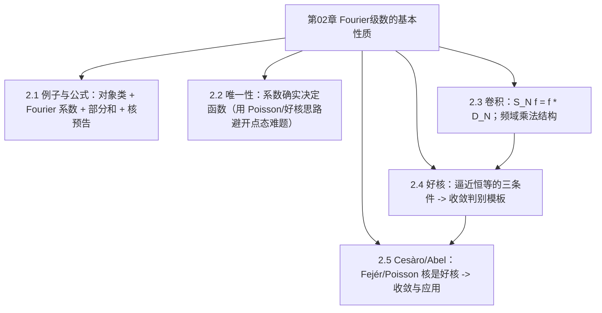

# 第02章 Fourier级数的基本性质 — 章节汇总

> [!abstract] 本章一句话
> 把 Fourier 级数从“形式求和”升级为“算子/核语言”：$S_N f=f*D_N$；然后抽象出“好核”判别条件，最终用 Fejér/Poisson 这两类好核给出 Cesàro/Abel 的稳定收敛与应用接口。
>
^overview

## 全章知识框架（2.1–2.5）

## 各节要点（嵌入聚合）
- ![[2.1 问题的例子和公式#^overview]]
- ![[2.2 Fourier级数的唯一性#^overview]]
- ![[2.3 卷积#^overview]]
- ![[2.4 好核#^overview]]
- ![[2.5 Cesaro和Abel求和#^overview]]

> [!faq]- 完备证明索引（第02章）
> - 2.1 Poisson 核（闭式与 Fourier 展开）：[[2.1 问题的例子和公式#^pf-2-1-poisson-kernel-closed-form]]
> - 2.2 Fourier 系数唯一性（通过 Poisson/好核）：[[2.2 Fourier级数的唯一性#^pf-2-2-uniqueness-via-poisson]]
> - 2.3 卷积-频域乘法：[[2.3 卷积#^pf-2-3-conv-mult]]
> - 2.3 部分和=卷积（$S_N f=f*D_N$）：[[2.3 卷积#^pf-2-3-sn-conv-dn]]
> - 2.4 好核逼近定理（连续一致收敛）：[[2.4 好核#^pf-2-4-good-kernel-approx]]
> - 2.5 Fejér 定理（Cesàro）：[[2.5 Cesaro和Abel求和#^pf-2-5-fejer]]
> - 2.5 Abel 定理（Poisson）：[[2.5 Cesaro和Abel求和#^pf-2-5-abel]]
>
> [!note] 去重策略声明（全库）
> - 第02章（尤其 2.3/2.4/2.5）作为“卷积/好核/Cesàro-Abel”的权威条目：以后跨章需要这些定义/证明，优先转链到这里的 block-id。
> - 第01章只保留动机与接口级推导；涉及同一结论时应回链到本章以统一口径，避免重复维护。
> - 若后续章节出现同一证明：优先把“完整证明真源”固定在一处（小节页或卡片），其他地方只做转引。
>
## 跨节主线（复习抓手）
1) **从级数到算子**：把“收敛”从 $\sum$ 的问题改写为 $\{S_N\}$ 的极限问题。  
2) **从算子到核**：$S_N f=f*D_N$，收敛由核 $D_N$ 的性质控制。  
3) **坏核的失败方式**：$D_N$ 非正、振荡、$L^1$ 不可控 ⇒ 点态收敛微妙。  
4) **好核的三条件**：归一化 + $L^1$ 有界 + 质量集中 ⇒ 卷积逼近。  
5) **修正求和=选好核**：Fejér 核（Cesàro）与 Poisson 核（Abel）满足好核 ⇒ 稳定收敛，并自然连接到调和延拓/Dirichlet 问题。

## 章级自测（5 题）
1) 解释“$S_N f=f*D_N$”这句话把收敛问题从哪里转移到哪里。  
2) 写出好核的三条条件，并逐条解释它们分别消除什么风险。  
3) 为什么 Dirichlet 核不是好核？至少给出一个结构性原因（非正性、$L^1$ 增长、质量不集中等）。  
4) 说明 Fejér 定理与 Abel 定理的共同证明框架是什么（卷积表示 + 好核逼近）。  
5) 用一句话说明 Abel 平均为何自然联系到单位圆盘的 Dirichlet 问题（Poisson 核/调和延拓）。

## 本章索引
- 节笔记：[[2.1 问题的例子和公式]]、[[2.2 Fourier级数的唯一性]]、[[2.3 卷积]]、[[2.4 好核]]、[[2.5 Cesaro和Abel求和]]
- 方法卡：[[Abel平均]]
- 练习与问题（题解）：[[2.6 练习]]、[[2.7 问题]]

#学习/傅里叶分析/第02章
