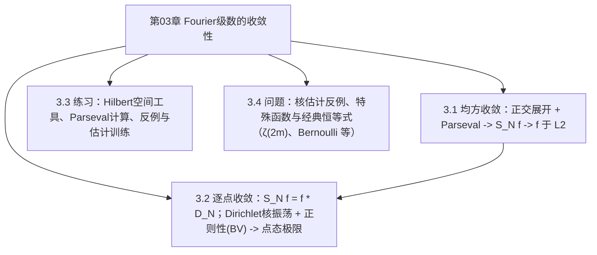

# 第03章 Fourier级数的收敛性 — 章节汇总

> [!abstract] 本章一句话
> 先在 $L^2(\mathbb T)$ 里用 Hilbert 空间正交展开“解决收敛”（均方收敛/Parseval），再用 Dirichlet 核的振荡积分分析解释点态收敛为何需要额外正则性（BV/分段光滑），并与第02章的好核求和法形成对照。
>
^overview

## 全章知识框架（3.1–3.4）

## 各节要点（嵌入聚合）
- ![[3.1 Fourier级数的均方收敛#^overview]]
- ![[3.2 逐点收敛#^overview]]
- ![[3.3 练习#^overview]]
- ![[3.4 问题#^overview]]

> [!note] 去重策略声明（全库）
> - 第03章（3.1–3.4）作为“收敛口径 + 训练题真源”权威条目：$L^2$ 正交展开（均方收敛/Parseval）、点态收敛门槛（Dirichlet 核 + BV）、以及练习/问题中的标准估计与经典恒等式推导。
> - 第02章（尤其 2.3/2.4/2.5）作为“核/卷积/好核/求和法权威条目”：涉及同一结论时优先回链其真源 block-id，避免跨章重复维护。
> - cards 只转引真源 block-id；证明/公式的可维护真源固定在节笔记（或第02章权威条目）中。
<!-- callout-break -->
> [!faq]- 完备证明索引（第03章，去重版）
> - 3.1 Bessel 不等式：[[3.1 Fourier级数的均方收敛#^pf-3-1-bessel]]
> - 3.1 Parseval 恒等式：[[3.1 Fourier级数的均方收敛#^pf-3-1-parseval]]
> - 3.1 $L^2$ 均方收敛（$S_N f\to f$）：[[3.1 Fourier级数的均方收敛#^pf-3-1-l2-convergence]]
> - 3.2 Dirichlet 点态收敛定理（BV/分段光滑）：[[3.2 逐点收敛#^pf-3-2-dirichlet-convergence]]
> - 3.3 $\ell^2$ 完备性：[[3.3 练习#^pf-3-3-02]]
> - 3.3 Wirtinger–Poincaré（周期/均值0）：[[3.3 练习#^pf-3-3-11]]
> - 3.3 $f'\in L^2$ 推绝对收敛（C-S+Parseval）：[[3.3 练习#^pf-3-3-14]]
> - 3.4 共轭 Dirichlet 核闭式：[[3.4 问题#^pf-3-4-01a]]
> - 3.4 共轭 Dirichlet 核 $L^1$ 对数估计：[[3.4 问题#^pf-3-4-01b]]
> - 3.4 Euler 型求和恒等式（cot）：[[3.4 问题#^pf-3-4-03b]]
> - 3.4 $\zeta(2m)$ 与 Bernoulli 数：[[3.4 问题#^pf-3-4-04c]]
> - 3.4 Bernoulli 多项式 Fourier 展开：[[3.4 问题#^pf-3-4-05e]]
>
## 跨节主线（复习抓手）
1) **两种收敛**：$L^2$ 收敛（平均意义） vs 点态收敛（局部意义）。  
2) **为什么 3.1 更“稳”**：Hilbert 空间结构把误差能量写成系数尾和。  
3) **为什么 3.2 更“难”**：Dirichlet 核非正且振荡，点态极限要靠局部正则性压住振荡积分。  
4) **与第02章的对照**：Fejér/Poisson 核是好核 ⇒ 不需太强正则性即可在连续点收敛；Dirichlet 核不满足好核性质 ⇒ 必须加条件。

## 章级自测（5 题）
1) 为什么 $S_N f\to f$ 于 $L^2$ 不推出 $S_N f(x)\to f(x)$？请给出概念层面的解释。  
2) 用一句话说明 Parseval 恒等式与“指数系完备性”的关系。  
3) Dirichlet 核的闭式是什么？它的哪一条性质造成点态收敛困难？  
4) 为什么跳点处的极限值是 $\frac{f(x+)+f(x-)}{2}$？这与对称化有什么关系？  
5) 说明“好核”思路如何绕开 Dirichlet 核的困难（对应到 2.5 的 Cesàro/Abel 求和）。

## 本章索引
- 目录：[[index]]
- 节笔记：[[3.1 Fourier级数的均方收敛]]、[[3.2 逐点收敛]]、[[3.3 练习]]、[[3.4 问题]]

#学习/傅里叶分析/第03章
