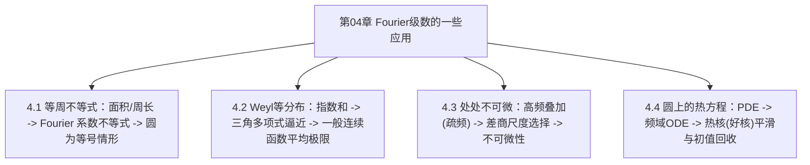

# 第04章 Fourier级数的一些应用 — 章节汇总

> [!abstract] 本章一句话
> 将“几何/数论/病态函数/PDE”统一翻译到 Fourier 语言：把对象的结构性性质（长度、均匀分布、可微性、扩散平滑）改写为**频域系数的可控估计**，再用正交性、核方法与不等式完成结论。
>
^overview

## 全章知识框架（4.1–4.4）

## 各节要点（嵌入聚合）
- ![[4.1 等周不等式#^overview]]
- ![[4.2 Weyl等分布定理#^overview]]
- ![[4.3 处处不可微的连续函数#^overview]]
- ![[4.4 圆上的热方程#^overview]]

## 跨节主线（复习抓手）
1) **4.1：几何量频域化**：把面积写成系数加权和，把周长写成导数能量；用 Cauchy–Schwarz/Parseval 关上不等式。  
2) **4.2：极限问题降维**：先证明三角多项式的平均极限，再用一致逼近把结论推广到一般连续函数。  
3) **4.3：病态来自高频**：连续性靠一致收敛；不可微性靠“选对差商尺度”，让某个高频项主导而其它项可控。  
4) **4.4：扩散=频域衰减**：热方程把每个频率独立衰减为 $e^{-n^2t}$；热核既提供显式解，也提供“立即平滑化/好核逼近”。

## 章级自测（5题）
1) 解释 4.1 中“面积与 Fourier 系数”的连接式是什么，为什么它能与周长产生比较。  
2) 写出 Weyl 判别准则（指数和条件），并说明为何它足以处理一般连续函数。  
3) 4.3 中证明不可微性的关键尺度如何选（$h$ 依赖于哪一个频率参数），为什么能压住其它项。  
4) 4.4 的解为何自然出现 $e^{-n^2t}$，这一步用到了什么正交结构。  
5) 4.4 中 $t\downarrow 0$ 的回收初值需要什么意义（连续点/Lebesgue 点/均方等），各自差异是什么。

## 本章索引
- 目录：[[index]]
- 节笔记：[[4.1 等周不等式]]、[[4.2 Weyl等分布定理]]、[[4.3 处处不可微的连续函数]]、[[4.4 圆上的热方程]]
- 章级入口：[[第04章 Fourier级数的一些应用 — ingest(MOC)]]

#学习/傅里叶分析/第04章
