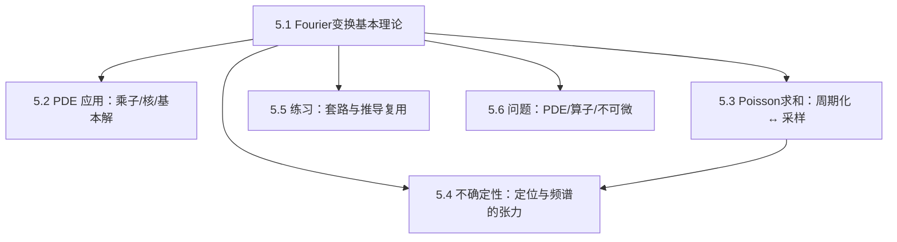

> [!abstract]
> 本章把“卷积/核/正交展开”的圆周视角升级为 **R 上的 Fourier 变换**：反演与 Plancherel 给出“可逆 + 等距”的基本框架；PDE 通过乘子对角化；Poisson 求和连接连续与离散；不确定性原理刻画“同时局部化不可能”与高斯极值结构。

^overview

## 全章结构图（主线）

## 各节要点（嵌入聚合）
- ![[5.1 Fourier变换的基本理论#^overview]]
- ![[5.2 偏微分方程中的一些应用#^overview]]
- ![[5.3 Poisson求和公式#^overview]]
- ![[5.4 Heisenberg不确定性原理#^overview]]
- ![[5.5 练习#^overview]]
- ![[5.6 问题#^overview]]

## 跨节接口（复用节点）
- **归一化常数一旦选定必须全章一致**：反演/Plancherel/Poisson/不确定性中的常数同时改变。
- **“先在 Schwartz 上做”是通用策略**：计算/交换极限/逐项求导都先在 $\mathcal S$，再用密度或范数完备性扩展到 $L^2$ 或分布。
- **PDE 的核心翻译**：微分算子在频域变成乘子（例如 $\partial_x\leftrightarrow i\xi$，$-\Delta\leftrightarrow |\xi|^2$）。
- **Poisson 求和是“连续↔离散”桥梁**：周期化求 Fourier 系数 ↔ 采样连续 Fourier 变换。
- **极值函数（高斯）贯穿两处**：既是可显式变换对象，又是 Heisenberg 不确定性中的等号情形。

## 本章索引
- 目录：[[index]]
- 章级入口：[[第05章 R上的Fourier变换 — ingest(MOC)]]
- 节笔记：[[5.1 Fourier变换的基本理论]]、[[5.2 偏微分方程中的一些应用]]、[[5.3 Poisson求和公式]]、[[5.4 Heisenberg不确定性原理]]、[[5.5 练习]]、[[5.6 问题]]
