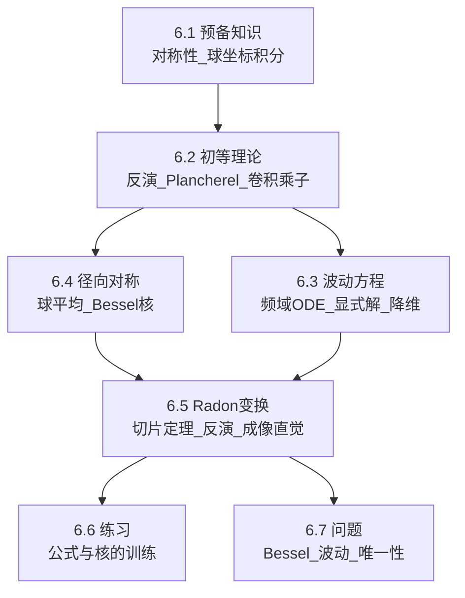

> [!abstract]
> 本章把第05章的一维理论升级到 $R^d$：反演与 Plancherel 在多变量仍成立；进一步把高维 PDE（波动方程）、径向对称（Bessel/Hankel 型积分核）与几何积分变换（Radon）统一到“频域乘子 + 对称性 + 核表示”的框架。

^overview

## 全章结构图（主线）

## 各节要点（嵌入聚合）
- ![[6.1 预备知识#^overview]]
- ![[6.2 Fourier变换的初等理论#^overview]]
- ![[6.3 R_d_x_R上的波动方程#^overview]]
- ![[6.4 径向对称与Bessel函数#^overview]]
- ![[6.5 Radon变换及其应用#^overview]]
- ![[6.6 练习#^overview]]
- ![[6.7 问题#^overview]]

## 跨节接口（复用节点）
- **常数约定必须全章一致**：定义中是否含 $2\pi$ 会同时改变反演、Plancherel、PDE 乘子与 Radon 切片定理的常数。
- **先在 Schwartz 空间做，再扩展**：交换积分/极限/求导时的合法性，统一先在 $\mathcal S(R^d)$ 成立，再用稠密性或范数完备性推广。
- **对称性是“降维器”**：旋转不变性把高维问题压缩到半径变量；球面积分产生 Bessel 核；Radon 把 $d$ 维对象投影到 1 维切片。
- **PDE 的核心翻译**：在频域把 $\Delta$ 与 $\sqrt{-\Delta}$ 变成乘子 $|\xi|^2$ 与 $|\xi|$，从而把 PDE 化为常系数 ODE。

## 本章索引
- 目录：[[index]]
- 章级入口：[[第06章 R_d上的Fourier变换 — ingest(MOC)]]
- 节笔记：[[6.1 预备知识]]、[[6.2 Fourier变换的初等理论]]、[[6.3 R_d_x_R上的波动方程]]、[[6.4 径向对称与Bessel函数]]、[[6.5 Radon变换及其应用]]、[[6.6 练习]]、[[6.7 问题]]
