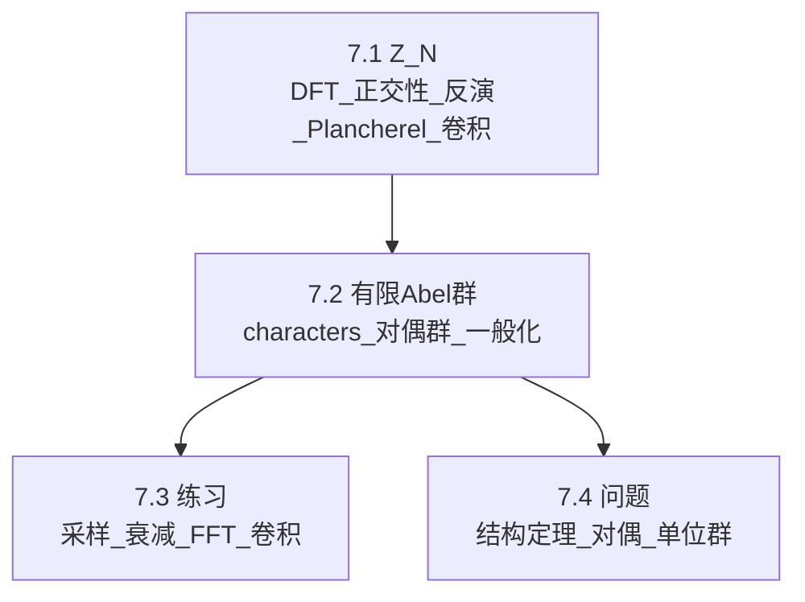

> [!abstract]
> 本章把 Fourier 分析从“连续/无限”转到“有限/离散”：在 $Z_N$ 与一般有限 Abel 群上，characters 构成正交基，从而得到反演与 Plancherel；卷积定理把组合计数/和式估计变成频域点乘。其核心不是积分技巧，而是“有限维 Hilbert 空间的正交展开 + 对偶群结构”。

^overview

## 全章结构图（主线）

## 各节要点（嵌入聚合）
- ![[7.1 Z_N上的Fourier分析#^overview]]
- ![[7.2 有限Abel群上的Fourier分析#^overview]]
- ![[7.3 练习#^overview]]
- ![[7.4 问题#^overview]]

## 跨节接口（复用节点）
- **归一化常数必须统一**：前向/逆向中 $1/N$ 或 $1/|G|$ 的放置决定反演、Plancherel、卷积定理的常数。
- **characters 是“正交基”**：所有计算接口都是“把函数投影到正交基上”，再做代数操作。
- **卷积类型要分清**：$Z_N$ 上是“循环卷积”；与 $R$ 上的卷积在形式上相似但本质不同。
- **对偶群的同构不自然**：$\widehat G\cong G$ 依赖选择（分解/基），不能当成“同一个对象”使用。

## 本章索引
- 目录：[[index]]
- 章级入口：[[第07章 有限Fourier分析 — ingest(MOC)]]
- 节笔记：[[7.1 Z_N上的Fourier分析]]、[[7.2 有限Abel群上的Fourier分析]]、[[7.3 练习]]、[[7.4 问题]]
