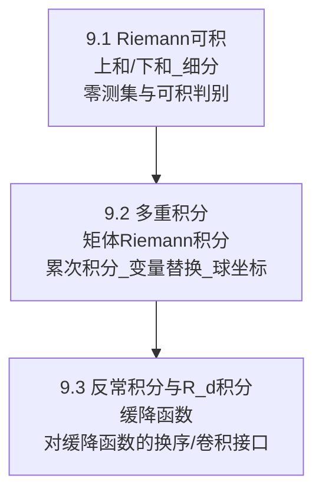

> [!abstract]
> 本章为后续 Fourier 分析建立“可交换/可极限/可换序”的积分基础：9.1 给出 Riemann 可积与其判别（尤其是不连续点与零测集的接口）；9.2 把一维积分推广到 $R^d$ 的矩体并建立累次积分、变量替换与球坐标；9.3 处理 $R^d$ 上的反常积分与缓降函数的积分，并证明对缓降函数可合法进行换序与卷积型积分操作（直接服务于 Fourier 变换与乘子法）。

^overview

## 全章结构图（主线）

## 各节要点（嵌入聚合）
- ![[9.1 Riemann可积函数的定义#^overview]]
- ![[9.2 多重积分#^overview]]
- ![[9.3 反常积分 R_d上的积分#^overview]]

## 跨节接口（复用节点）
- **零测集/不连续点 → Riemann 可积**：9.1 把“几乎处处连续”变成可积判别，这是后续允许“忽略坏点”的核心接口。
- **迭代积分与换序**：9.2 的累次积分把高维积分拆成一维链条；换序成立需要明确条件（连续/可积/缓降等）。
- **变量替换与 Jacobian**：9.2 的变元公式是后续对称性计算（球坐标、旋转不变核）的标准入口。
- **反常积分的极限方式**：9.3 强调在 $R^d$ 上把积分定义为 $N\to\infty$ 的极限（立方体/球等），并给出缓降条件保证“方式无关/可换序”的口径。

## 本章索引
- 目录：[[index]]
- 章级入口：[[第09章 积分 — ingest(MOC)]]
- 节笔记：[[9.1 Riemann可积函数的定义]]、[[9.2 多重积分]]、[[9.3 反常积分 R_d上的积分]]
