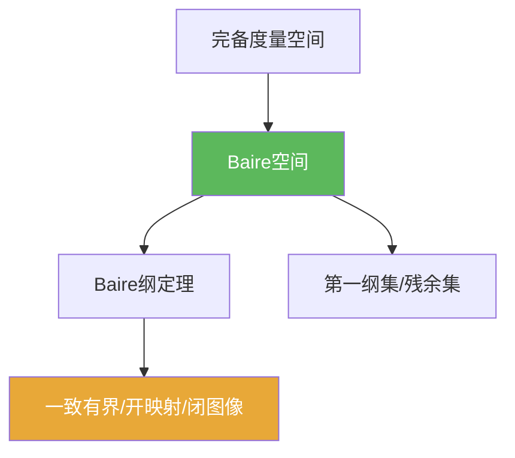

# Baire空间

> [!abstract] 概述
> ==Baire空间==是一类“范畴意义下不会被可数稀薄集合吃掉”的拓扑/度量空间。  
> 在本书的使用口径里：**完备度量空间（尤其 Banach 空间）都是 Baire 空间**，因此 Baire 纲定理能稳定地把“局部/逐点信息”升级为“在某个球上的统一控制”。

## 定义

> [!def] Baire空间
> 拓扑空间 $X$ 称为 Baire 空间，如果任意可数个稠密开集的交仍稠密，即对任意稠密开集列 $U_1,U_2,\dots$，
> $$\bigcap_{n=1}^\infty U_n$$
> 在 $X$ 中稠密。

## 核心性质（命题工具箱）

| 性质/命题 | 表述（可直接引用） | 用途（做题时怎么用） |
|---|---|---|
| 完备度量空间是 Baire | 任意完备度量空间都是 Baire 空间 | 题目给“完备/Banach”时可直接套 Baire 方法 |
| 第一纲集补集稠密 | 若 $A$ 是第一纲集，则 $X\setminus A$ 稠密 | 把“坏集”写成第一纲集，就能推出“好性质典型/稠密” |
| 闭集覆盖版 | 若 $X=\bigcup_n F_n$（$F_n$ 闭），则某个 $F_N$ 有内点 | 用于“抽好球”，是 4.2 的发动机 |

## 关系网络

## 章节扩展

### 第04章：Baire纲定理的应用

- Baire 空间定义与使用入口：[[4.1 Baire纲定理#二、核心思想]]
- Baire 方法“抽好球”的典型输出：[[4.2 一致有界原理#二、核心思想]]

## 补充

> [!info] 常见误区
> “Baire 空间”说的是范畴意义下的“大”，与测度意义下的“大”不是一回事；不要用“测度 0/测度 1”的直觉替代它。
>
> **参考（权威外链）**
> - https://en.wikipedia.org/wiki/Baire_space

## 参见

- [[Baire纲定理]]
- [[第一纲集]]
- [[完备度量空间]]
- [[Banach空间]]

