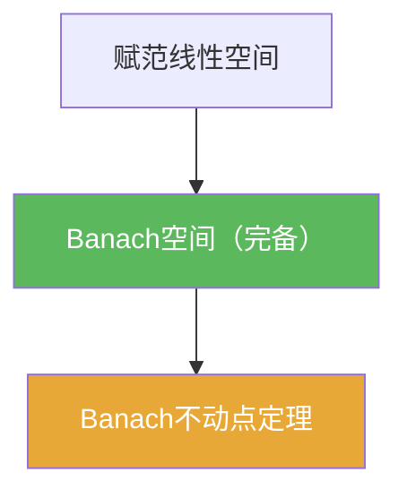

# Banach空间

> [!abstract] 概述
> ==Banach空间==是==完备的赋范线性空间==：既保留线性结构，又保证 Cauchy 列不“跑出空间”。  
> 做题时它提供最重要的“收尾机制”：只要你能把构造（迭代、级数、函数列）证明成 Cauchy，就能在空间内得到真正的极限对象。

## 定义

> [!def] 定义
> 赋范线性空间 $(X,\|\cdot\|)$ 若在 $d(x,y)=\|x-y\|$ 下完备，则称 $X$ 为 Banach 空间。

## 核心性质（命题工具箱）

| 性质/命题 | 表述（可直接引用） | 用途（做题时怎么用） |
|------|------|------|
| 等价表述 | Banach空间 = 赋范空间 +（由范数诱导的度量下）完备 | 在证明中可自由切换“范数/Cauchy/度量”语言 |
| 闭子空间仍 Banach | 若 $Y\subset X$ 是闭线性子空间且 $X$ Banach，则 $Y$ Banach | 常用于把问题限制到闭子空间/核/像/闭球 |
| Cauchy 收尾 | 任意 Cauchy 列在 $X$ 中收敛 | 迭代法/级数求和/极限构造的最后一步 |
| 定理工作台 | 开映射/闭图像/有界逆 等“Baire 三件套”在 Banach 上成立 | 第二章核心定理链路的统一假设 |

## 典型例子与非例子

| 类型 | 例子 | 提醒 |
|---|---|---|
| 典型 Banach | $(C([0,1]),\|\cdot\|_\infty)$ | 连续函数在上确界范数下完备 |
| 典型 Banach | $(\ell^p,\|\cdot\|_p)$（$1\le p\le\infty$） | 经典序列空间 |
| 非例子 | 多项式空间在 $\|\cdot\|_\infty$ 下 | 不是闭的，Cauchy 极限可能是非多项式 |

## 关系网络

## 章节扩展

### 第01章：度量空间

- 1.4：给出 Banach 空间定义与基本例子：[[1.4 赋范线性空间#二、核心思想]]

### 第02章：线性算子与线性泛函

- 2.3：Baire 纲定理在 Banach 空间上推出开映射/闭图像/有界逆三件套：[[2.3 纲与开映射定理#二、核心思想]]
- 2.6：谱论以 $T\in B(X)$ 为对象，$X$ 通常取 Banach 空间：[[2.6 线性算子的谱#二、核心思想]]

## 补充

> [!info] 常见误区与来源
>
> - 误区：把“有界”当作“完备”。有界只说明能装进一个球，完备是关于 Cauchy 列极限是否落在空间内。  
> - 误区：把“线性”当作关键。Banach 的关键是“可做极限过程”，线性只是结构背景。
>
> **参考（权威外链）**
> - MIT 18.102 Functional Analysis（课程讲义入口）：https://ocw.mit.edu/courses/18-102-introduction-to-functional-analysis-spring-2021/pages/lecture-notes-and-readings/
> - Wikipedia: Banach space: https://en.wikipedia.org/wiki/Banach_space

## 参见

- [[Banach不动点定理]]
- [[有界线性算子]]
