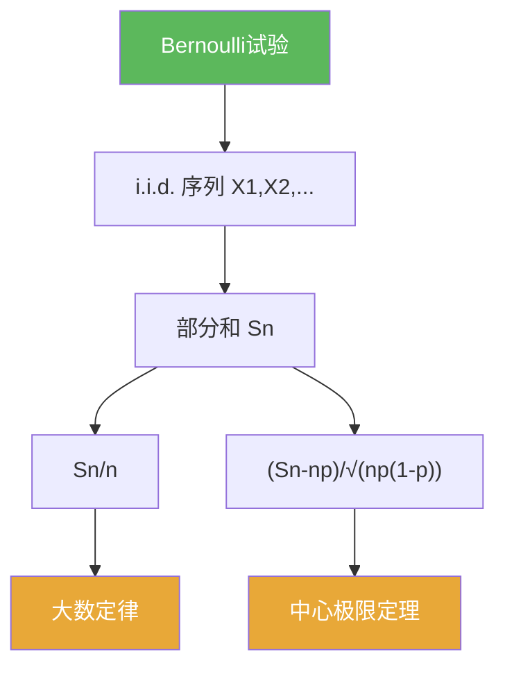

# Bernoulli试验

> [!abstract] 概述
> ==Bernoulli 试验==是概率论的最小模型：每次试验只有两种结果（成功/失败），并用参数 $p$ 描述成功概率。  
> 在本章中，它既是构造 i.i.d. 序列的入口，也是理解“大数定律/中心极限定理”的直觉原型。

## 定义

> [!def] Bernoulli 随机变量
> 随机变量 $X$ 满足 $X\in\{0,1\}$ 且
> $$\mathbb P(X=1)=p,\qquad \mathbb P(X=0)=1-p,$$
> 则称 $X$ 服从 Bernoulli 分布，记 $X\sim \mathrm{Bernoulli}(p)$。

## 核心性质（命题工具箱）

| 性质/命题 | 表述（可直接引用） | 用途（做题时怎么用） |
|---|---|---|
| 0/1 简化 | $X^2=X$ | 快速计算矩与方差 |
| 期望/方差 | $\mathbb E[X]=p$，$\mathrm{Var}(X)=p(1-p)$ | 给出“部分和”的尺度 |
| 二项分布 | 若 $X_1,\dots,X_n$ i.i.d. Bernoulli$(p)$，则 $S_n=\sum X_k\sim\mathrm{Binomial}(n,p)$ | 次数/频率题的标准入口 |
| 标准化偏差 | $(S_n-np)/\sqrt{np(1-p)}$ | CLT 的典型标准化形式 |

## 关系网络

## 章节扩展

### 第05章：概率论基础

- 5.1：最小模型与部分和视角：[[5.1 Bernoulli试验#二、核心思想]]
- 5.2：推广到一般独立随机变量之和：[[5.2 独立随机变量的和#二、核心思想]]

## 补充

> [!info] 常见误区
> “Bernoulli 试验”指的是单次 0/1 结果；“二项分布”描述的是多次独立 Bernoulli 的总成功次数。
>
> **参考（权威外链）**
> - https://en.wikipedia.org/wiki/Bernoulli_trial

## 参见

- [[随机变量]]
- [[独立性]]
- [[大数定律]]
- [[中心极限定理]]

