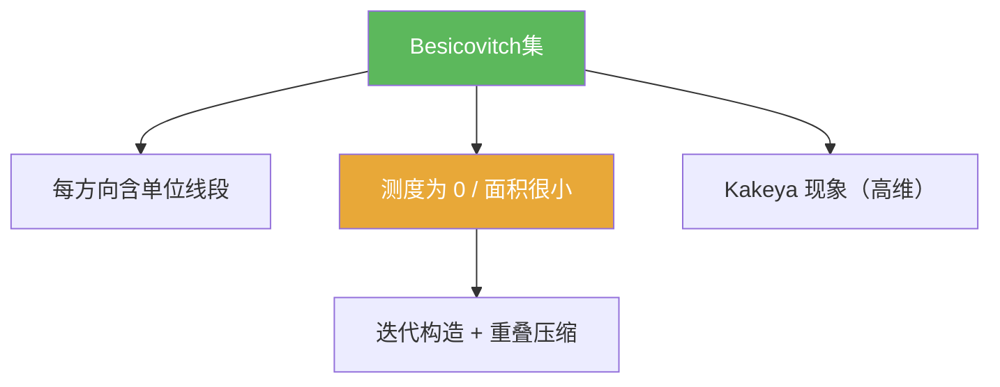

# Besicovitch集

> [!abstract] 概述
> ==Besicovitch 集==（Kakeya 集）是几何测度论中的经典反例对象：在平面中可以找到测度为 0 的集合，却仍包含“每个方向的一条单位线段”。  
> 在本章中它的作用是：作为“极限构造 + 重叠压缩”的代表，提醒我们不要用有限维直觉来判断“方向全覆盖 ⇒ 面积很大”。

## 定义

> [!def] Besicovitch / Kakeya 集（平面）
> $E\subset\mathbb{R}^2$ 称为 Besicovitch 集，如果对任意方向（单位向量）$v$，存在长度为 1 的线段 $I_v$，使得 $I_v$ 平行于 $v$ 且 $I_v\subset E$。

## 核心性质（命题工具箱）

| 性质/命题 | 表述（可直接引用） | 用途（做题时怎么用） |
|---|---|---|
| 方向全覆盖 | 对每个方向 $v$，存在 $I_v\subset E$ | 判断对象是否为 Kakeya/Besicovitch 型 |
| 面积可任意小 | 对任意 $\varepsilon>0$，存在 Besicovitch 集 $E$ 使 $m(E)<\varepsilon$ | 构造反例/反直觉：方向不推出面积 |
| 测度为 0 的存在性 | 存在 $m(E)=0$ 的 Besicovitch 集 | 作为 Besicovitch 定理的核心结论入口 |

## 关系网络

## 章节扩展

### 第04章：Baire纲定理的应用

- 本节 notes：[[4.5 Besicovitch集#二、核心思想]]
- “范畴 vs 测度”的定位说明：[[4.5 Besicovitch集#三、补充理解与易混淆点]]

## 补充

> [!info] 高维提示（只需知道关键词）
> Kakeya 集在高维与调和分析、限制估计、Kakeya 猜想等深问题相关；本库只把它作为反直觉示例，不展开。
>
> **参考（权威外链）**
> - https://en.wikipedia.org/wiki/Kakeya_set

## 参见

- [[Besicovitch定理]]
- [[第一纲集]]

