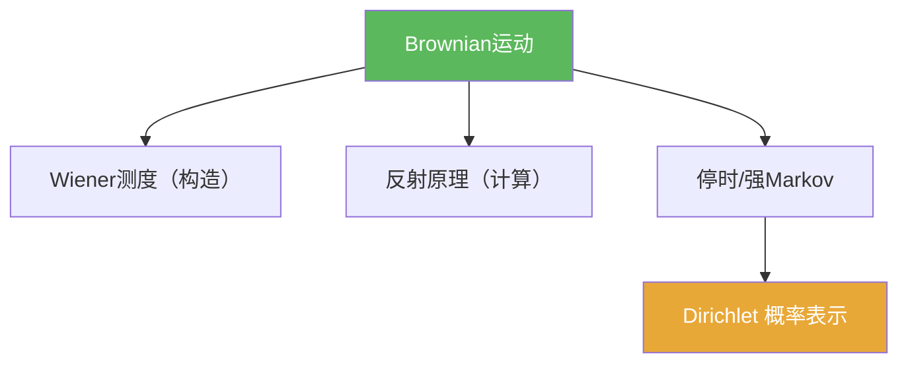

# Brownian运动

> [!abstract] 概述
> ==Brownian 运动==（Wiener 过程）是最核心的连续时间随机过程模型：具有独立平稳高斯增量与连续路径。  
> 在本章中它既是“构造对象”（Wiener 测度），也是“可计算对象”（反射原理、首达时、强 Markov、Dirichlet 概率表示）。

## 定义

> [!def] Brownian运动（提示性定义）
> 过程 $\{B_t\}_{t\ge 0}$ 满足：$B_0=0$；独立增量；$B_t-B_s\sim N(0,t-s)$；路径连续。

## 核心性质（命题工具箱）

| 性质/命题 | 表述（可直接引用） | 用途（做题时怎么用） |
|---|---|---|
| 协方差 | $\mathbb E[B_sB_t]=\min(s,t)$ | 计算有限维分布、识别高斯过程 |
| 缩放 | $\{B_{ct}/\sqrt c\}$ 仍为 Brownian | 尺度估计、归一化 |
| 反射原理 | $\mathbb P(\sup_{s\le t}B_s\ge a)=2\mathbb P(B_t\ge a)$ | 最大值/首达时概率 |
| 强 Markov | 停时处可“重启” | 处理退出时刻、拼接计算 |

## 关系网络

## 章节扩展

### 第06章：Brownian运动引论

- 定义与协方差工具箱：[[6.1 框架#二、核心思想]]
- 构造路线：[[6.3 Brownian运动的构造#二、核心思想]]
- 可计算性质：[[6.4 Brownian运动的进一步的性质#二、核心思想]]
- 停时强 Markov：[[6.5 停时和强Markov性质#二、核心思想]]
- Dirichlet 概率表示：[[6.6 Dirichlet问题的解#二、核心思想]]

## 补充

> [!info] 参考（权威外链）
> - https://en.wikipedia.org/wiki/Brownian_motion

## 参见

- [[随机过程]]
- [[Wiener测度]]
- [[反射原理]]
- [[强Markov性质]]

