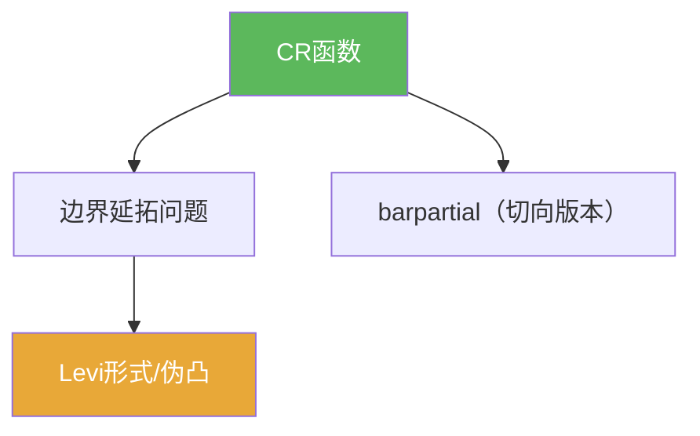

# CR函数

> [!abstract] 概述
> ==CR 函数==是“边界上的全纯性”：当函数只定义在边界（或 CR 流形）上时，全纯条件会投影成切向的 Cauchy–Riemann 条件。  
> 在第07章里，它连接了边界问题与 Levi/伪凸几何。

## 定义（提示性）

> [!def] CR函数（提示性）
> 在光滑边界 $\partial D$ 上，若函数满足切向 C-R 条件（教材记作 $\bar\partial_b f=0$ 或等价形式），则称其为 CR 函数。

## 命题工具箱

| 性质/命题 | 表述 | 用途 |
|---|---|---|
| 必要性 | 全纯函数的边界迹必为 CR | 检验边界数据是否可能来自全纯函数 |
| 充分性需几何 | CR ⇒ 可延拓往往需伪凸/Levi 条件 | 解释为何引入 Levi/伪凸 |
| 与 barpartial 的关系 | $\bar\partial_b$ 可看作 $\bar\partial$ 的切向版本 | 把边界问题与 PDE 统一语言 |

## 关系网络

## 章节扩展

### 第07章：多复变引论

- 边界口径入口：[[7.4 边界情形 切向Cauchy-Riemann方程#二、核心思想]]
- Levi 的几何开关：[[7.5 Levi形式#二、核心思想]]

## 补充

> [!info] 参考（权威外链）
> - https://en.wikipedia.org/wiki/CR_manifold

## 参见

- [[Levi形式]]
- [[伪凸域]]
- [[barpartial算子]]

