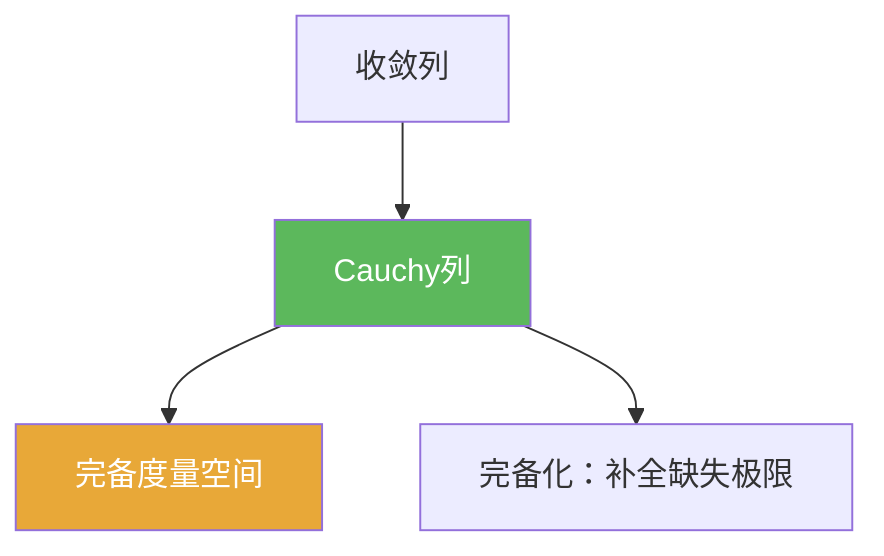

# Cauchy列

> [!abstract] 概述
> ==Cauchy列==描述“序列内部越来越靠近”，不需要先知道极限点在哪里。  
> 在泛函分析里，它更像一个“极限存在的门槛条件”：很多构造（极限、解的存在、迭代逼近）先证明 Cauchy，再把“收敛”交给完备性处理。

## 定义

> [!def] Cauchy列
>
> 在度量空间 $(X,d)$ 中，序列 $(x_n)$ 若满足：
> $$\forall\varepsilon>0,\ \exists N,\ \forall m,n\ge N:\ d(x_m,x_n)<\varepsilon,$$
> 则称 $(x_n)$ 为 **Cauchy列**。

## 核心性质（命题工具箱）

| 性质/命题 | 表述（可直接引用） | 用途（做题时怎么用） |
|------|------|------|
| 收敛 $\Rightarrow$ Cauchy | 若 $x_n\to x$，则 $(x_n)$ 是 Cauchy | 证明“不是 Cauchy”即可否定收敛（常用于构造反例） |
| Cauchy $\Rightarrow$ 收敛（需完备） | 若 $(X,d)$ 完备，则任意 Cauchy 列都收敛于某个 $x\in X$ | 在 Banach/Hilbert 空间中最常用：先估计成 Cauchy，再用完备性收尾 |
| 子列与等价性 | Cauchy 列的任意子列仍是 Cauchy；两 Cauchy 列若距离趋于 0 则“等价” | 完备化构造把“Cauchy列等价类”当作新空间的点（见 [[完备化]]) |
| 映射保持性 | 若 $f$ 是 Lipschitz（特别是等距/连续线性有界算子），则 $x_n$ Cauchy $\Rightarrow f(x_n)$ Cauchy | 在算子论里：用有界性把 Cauchy 性“推送”到像空间 |

## 典型例子与非例子

| 类型 | 例子 | 提醒 |
|---|---|---|
| Cauchy 且收敛 | $\mathbb{R}$ 中 $x_n=1/n$ | 完备空间内 Cauchy 一定收敛 |
| Cauchy 但不收敛 | 有理数 $\mathbb{Q}$ 中逼近 $\sqrt2$ 的序列 | 说明 $\mathbb{Q}$ 在欧氏度量下不完备 |

## 关系网络

## 章节扩展

### 第01章：度量空间

- 在 1.1 用 Cauchy 列定义完备性，并解释为何压缩映射需要完备：[[1.1 压缩映射原理#二、核心思想]]
- 在 1.2 用“Cauchy列等价类”构造完备化：[[1.2 完备化#二、核心思想]]

## 补充

> [!info] 常见误区与来源
>
> - 误区：把 “Cauchy” 当作“有极限”。Cauchy 只说明“内部收敛趋势”，极限是否落在空间里需要完备性。  
> - 误区：在非完备空间里用“Cauchy”替代“收敛”，会导致结论错误（例如迭代法的极限可能跑到空间外）。
>
> **参考（权威外链）**
> - Complete Metric Spaces（含 Cauchy/complete 的标准定义）：https://math.hws.edu/eck/math331/f19/5-completeness.pdf
> - Wikipedia: Cauchy sequence: https://en.wikipedia.org/wiki/Cauchy_sequence

## 参见

- [[完备度量空间]]
- [[完备化]]
