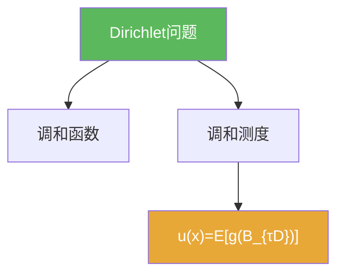

# Dirichlet问题

> [!abstract] 概述
> ==Dirichlet 问题==是经典边界值问题：在区域内调和、在边界取给定值。  
> 在本章中，它的“概率解法”是 Brownian 运动的重要应用：用退出分布把边界值平均进来。

## 定义

> [!def] Dirichlet 问题（提示性）
> 给定区域 $D$ 与边界函数 $g$，求 $u$ 满足：$\Delta u=0$（在 $D$ 内）且 $u|_{\partial D}=g$（按合适意义）。

## 核心性质（命题工具箱）

| 性质/命题 | 表述 | 用途 |
|---|---|---|
| 概率表示 | $u(x)=\mathbb E^x[g(B_{\tau_D})]$ | 连接 Brownian 与 PDE |
| 唯一性 | 最大值原理常给唯一性 | 证明“概率候选解就是解” |
| 边界正则性 | 正则边界点确保 $u$ 的边界取值 | 处理“边界条件是否成立” |

## 关系网络

## 章节扩展

### 第06章：Brownian运动引论

- 概率解法主线：[[6.6 Dirichlet问题的解#二、核心思想]]

## 补充

> [!info] 参考（权威外链）
> - https://en.wikipedia.org/wiki/Dirichlet_problem

## 参见

- [[调和函数]]
- [[调和测度]]
- [[Dirichlet问题的概率表示定理]]

