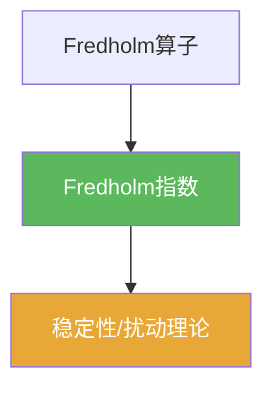

# Fredholm指数

> [!abstract] 概述
> ==Fredholm指数==是 Fredholm 算子的整数不变量，衡量“核维数与余核维数的差”。  
> 它在紧扰动下通常稳定，是很多存在性/计数性结论的核心量。

## 定义

> [!def] Fredholm指数
> 若 $T:X\to Y$ 是 Fredholm 算子，则定义
> $$\operatorname{index}(T)=\dim\ker T-\operatorname{codim}\operatorname{Ran}T.$$

## 核心性质（命题工具箱）

| 性质/命题 | 表述（可直接引用） | 用途（做题时怎么用） |
|------|------|------|
| 可逆则指数为 0 | 若 $T$ 可逆，则 $\ker T=\{0\}$ 且 $\operatorname{Ran}T=Y$，故 $\operatorname{index}(T)=0$ | 快速 sanity check |
| 指数为 0 不必可逆 | $\operatorname{index}(T)=0$ 只说明核维与余核维相同，不保证二者为 0 | 避免误推理 |
| 稳定性直觉 | 紧扰动常不改变指数（在合适条件下） | 用于证明“结构不变性”与应用 |

## 典型例子与非例子

| 类型 | 例子 | 提醒 |
|---|---|---|
| 典型 | 有限维矩阵的指数恒为 0 | 有限维中余核维数 = 核维数（秩-零化度） |
| 典型 | $I-K$（$K$ 紧）多为指数 0 的情形 | 与 Riesz–Fredholm 理论配套 |

## 关系网络

## 章节扩展

### 第03章：紧算子与Fredholm算子

- 3.6：指数定义与直觉：[[3.6 Fredholm算子#二、核心思想]]

## 补充

> [!info] 参考（权威外链）
> - MIT 18.155 Notes (Fredholm index): https://math.mit.edu/~rbm/18.155-F16/L13.pdf

## 参见

- [[Fredholm算子]]
