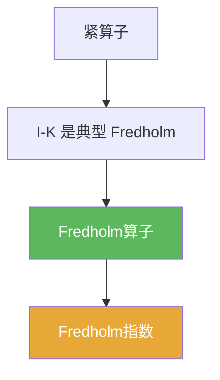

# Fredholm算子

> [!abstract] 概述
> ==Fredholm算子==把“不可逆性”限制在有限维上：核与余核有限维，且值域闭。  
> 它统一描述“存在性/相容条件/指数不变量”，并在 PDE 与积分方程中频繁出现。

## 定义

> [!def] Fredholm算子
> 设 $T\in B(X,Y)$。若满足：
> 1) $\dim\ker T<\infty$  
> 2) $\operatorname{Ran}T$ 闭  
> 3) $\operatorname{codim}\operatorname{Ran}T<\infty$  
> 则称 $T$ 为 Fredholm 算子。

## 核心性质（命题工具箱）

| 性质/命题 | 表述（可直接引用） | 用途（做题时怎么用） |
|------|------|------|
| 指数定义 | $\operatorname{index}(T)=\dim\ker T-\operatorname{codim}\operatorname{Ran}T$ | 把“可解性结构”编码成整数（见 [[Fredholm指数]]) |
| 稳定性直觉 | Fredholm 性常在小扰动/紧扰动下保持 | 解释为何指数是“离散稳定量” |
| 与 $I-K$ | 若 $K$ 紧，则 $I-K$ 往往是 Fredholm 类型 | 连接紧算子与 Fredholm 理论（见 [[Riesz-Fredholm定理]]) |

## 典型例子与非例子

| 类型 | 例子 | 提醒 |
|---|---|---|
| 典型 | 有限维线性算子（矩阵） | 全部都是 Fredholm（核/余核有限维自动成立） |
| 典型 | $I-K$（$K$ 紧） | 第03章核心模型 |
| 非例子提醒 | 值域不闭的算子 | 即使核有限维，也不一定 Fredholm |

## 关系网络

## 章节扩展

### 第03章：紧算子与Fredholm算子

- 3.6：定义与指数：[[3.6 Fredholm算子#二、核心思想]]
- 3.2：Riesz–Fredholm 理论提供典型来源：[[3.2 Riesz-Fredholm理论#二、核心思想]]

## 补充

> [!info] 参考（权威外链）
> - MIT 18.155 Notes (Fredholm operators): https://math.mit.edu/~rbm/18.155-F16/L13.pdf

## 参见

- [[Fredholm指数]]
- [[Riesz-Fredholm定理]]
- [[紧算子]]
