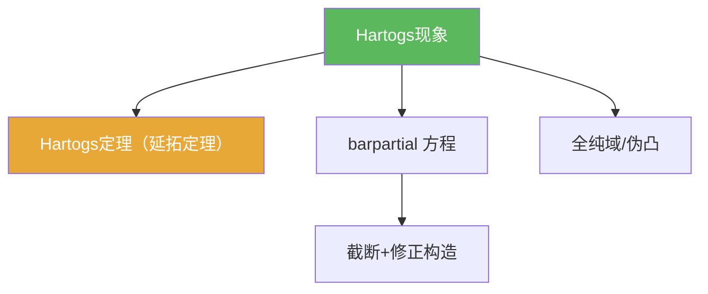

# Hartogs现象

> [!abstract] 概述
> ==Hartogs 现象==是多复变最典型的反直觉之一：在 $n\ge 2$ 时，一些看似会产生奇性的“洞”反而是可去的——全纯函数会自动延拓把洞填上。

## 定义（现象口径）

> [!def] Hartogs现象（直觉表述）
> 在 $\mathbb C^n$（$n\ge 2$）中，存在穿孔域/缺失集合 $K$，使得定义在 $\Omega\setminus K$ 上的全纯函数可以唯一延拓到 $\Omega$。

## 命题工具箱

| 性质/命题 | 表述（可直接引用） | 用途 |
|---|---|---|
| 维数门槛 | 典型现象要求 $n\ge 2$ | 与一复变奇点理论对比 |
| 唯一性 | 延拓若存在通常唯一 | 写作证明的收口 |
| 工具化证明 | 常用 $\bar\partial$ 修正构造延拓 | 7.3 的核心套路 |

## 关系网络

## 章节扩展

### 第07章：多复变引论

- 例子入口：[[7.2 Hartogs现象 一个例子#二、核心思想]]
- 工具化证明：[[7.3 Hartogs定理 非齐次Cauchy-Riemann方程#二、核心思想]]

## 补充

> [!info] 参考（权威外链）
> - https://en.wikipedia.org/wiki/Hartogs%27_theorem

## 参见

- [[barpartial算子]]
- [[Hartogs定理（延拓定理）]]
- [[全纯域]]

