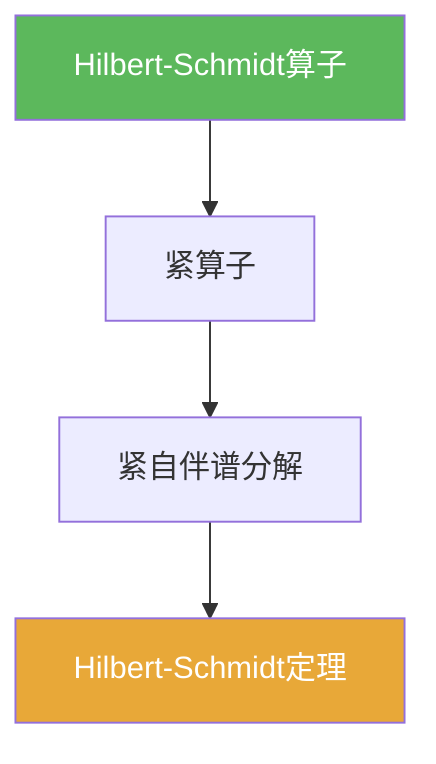

# Hilbert-Schmidt算子

> [!abstract] 概述
> ==Hilbert-Schmidt算子==通常指 Hilbert 空间上一类“平方可和”的有界算子类。  
> 它们是紧算子的典型来源之一，并与本章的 Hilbert-Schmidt 谱分解结论形成配套。

## 定义

> [!def] Hilbert-Schmidt算子（提示性定义）
> 设 $H$ 为 Hilbert 空间，取一组正交规范基 $(e_n)$。若
> $$\sum_{n}\|Te_n\|^2<\infty,$$
> 则称 $T$ 为 Hilbert-Schmidt 算子（其定义与基无关，这是更深入的结论）。

## 核心性质（命题工具箱）

| 性质/命题 | 表述（可直接引用） | 用途（做题时怎么用） |
|------|------|------|
| 紧性来源 | Hilbert-Schmidt 算子是紧算子（经典结论） | 判别紧性的一条可操作途径 |
| 与核算子联系 | 许多积分算子在 $L^2$ 上满足 Hilbert-Schmidt 条件 | 在应用中把“核平方可积”转成紧性 |
| 谱分解背景 | 在紧自伴情形可用正交基进行谱分解 | 连接 [[Hilbert-Schmidt定理]] |

## 典型例子与非例子

| 类型 | 例子 | 提醒 |
|---|---|---|
| 典型 | $L^2$ 上核平方可积的积分算子 | 这是 Hilbert-Schmidt 最常见来源 |
| 非例子提醒 | 恒等算子（无限维 Hilbert） | 不满足平方可和条件，且不紧 |

## 关系网络

## 章节扩展

### 第03章：紧算子与Fredholm算子

- 3.4：Hilbert 场景的谱分解：[[3.4 Hilbert-Schmidt定理#二、核心思想]]

## 补充

> [!info] 来源
> - Wikipedia: Hilbert–Schmidt operator: https://en.wikipedia.org/wiki/Hilbert%E2%80%93Schmidt_operator

## 参见

- [[Hilbert-Schmidt定理]]
- [[紧算子]]
- [[Hilbert空间]]
