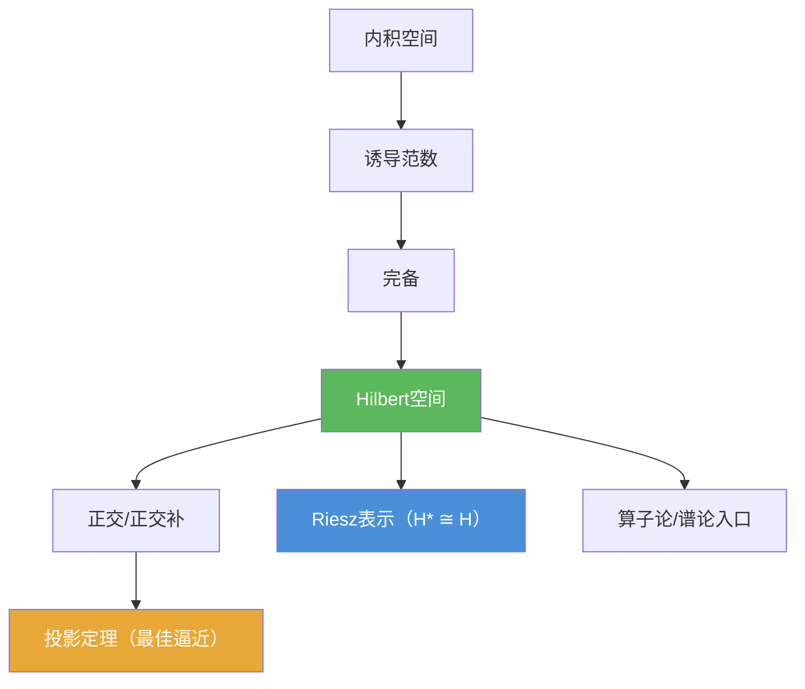

# Hilbert空间

> [!abstract] 概述
> ==Hilbert空间==是==完备内积空间==：内积 $\langle x,y\rangle$ 提供“角度/正交/投影”的几何语言，完备性保证极限过程不会“跑出空间”。  
> 在算子论与谱论中，Hilbert空间往往是“最像欧氏空间”的无限维舞台：很多结论可以被组织成“命题工具箱”，直接用于最小化、最佳逼近与对偶表示等问题。

## 定义

> [!def] Hilbert空间
>
> 设 $H$ 为（实或复）内积空间，内积记为 $\langle\cdot,\cdot\rangle$，诱导范数为
> $$\|x\|=\sqrt{\langle x,x\rangle}.$$
> 若 $H$ 在该范数（等价地：度量 $d(x,y)=\|x-y\|$）下完备，则称 $H$ 为 **Hilbert空间**。

## 核心性质（命题工具箱）

| 性质/命题 | 表述（可直接引用） | 用途（做题时怎么用） |
|------|------|------|
| Cauchy–Schwarz | $|\langle x,y\rangle|\le \|x\|\|y\|$ | 控制内积、证明连续性与估计误差；见 [[Cauchy-Schwarz不等式]] |
| 平行四边形恒等式 | $\|x+y\|^2+\|x-y\|^2=2\|x\|^2+2\|y\|^2$ | 判断“范数是否来自内积”；区分 Hilbert 与一般 Banach |
| 极化恒等式（复） | $\langle x,y\rangle=\frac14\sum_{k=0}^{3}i^k\|x+i^k y\|^2$ | 由范数恢复内积（当范数满足平行四边形恒等式时） |
| 勾股/正交分解 | 若 $\langle x,y\rangle=0$ 则 $\|x+y\|^2=\|x\|^2+\|y\|^2$ | 把“几何直觉”转成可计算公式；用于误差分解 |
| 正交补（闭性） | 对任意子集 $M\subset H$，$M^\perp$ 为闭线性子空间 | 构造分解 $H=M\oplus M^\perp$ 的前置步骤 |
| 投影定理（闭子空间） | 若 $M\subset H$ 闭，则对任意 $x\in H$ 存在唯一 $m\in M$ 使 $\|x-m\|=\inf_{y\in M}\|x-y\|$，且 $x-m\perp M$ | 最佳逼近/最小二乘；把“最小化问题”变成“正交条件” |
| Riesz 表示 | $H^\*\cong H$：每个连续线性泛函 $f$ 唯一表示为 $f(x)=\langle x,y\rangle$ | 把对偶问题转成“找向量”；见 [[Riesz表示定理]] |

## 典型例子与非例子

| 类型 | 空间 | 提醒 |
|---|---|---|
| 典型 Hilbert | $\mathbb{R}^n,\mathbb{C}^n$ | 有限维内积空间必完备 |
| 典型 Hilbert | $\ell^2$ | 序列平方可和；算子论常用例子 |
| 典型 Hilbert | $L^2(\Omega)$ | 以等价类定义；积分内积 $\langle f,g\rangle=\int f\overline g$ |
| 常见“非 Hilbert” | $L^p(\Omega)$（$p\ne 2$） | 一般不能由内积诱导该范数（平行四边形恒等式失败） |

## 关系网络

- [[内积空间]] 给出 $\langle x,y\rangle$，从而得到范数与度量
- “完备性”把内积空间升级为 Hilbert空间（可做极限/最小化）
- 投影定理与 [[Riesz表示定理]] 是第02章（尤其 2.2）里最常反复调用的“工具”

## 章节扩展

### 第01章：度量空间

- 1.6：Hilbert 空间的入口与直觉：[[1.6 内积空间#二、核心思想]]

### 第02章：线性算子与线性泛函

- 2.2：Riesz 表示定理给出 $H^\*\cong H$，是 Hilbert 空间对偶理论的核心：[[2.2 Riesz表示定理及其应用#二、核心思想]]

### 第03章：紧算子与Fredholm算子

- 3.4：Hilbert 场景下紧自伴算子的谱分解：[[3.4 Hilbert-Schmidt定理#二、核心思想]]
- 3.5：PDE 应用常借助 Hilbert 结构（弱形式/表示）：[[3.5 对椭圆型方程的应用#二、核心思想]]

## 补充

> [!info] 常见误区（两句话避坑）
>
> 1) “内积空间一定完备”是错的：完备性是额外条件，决定了很多极限/最小化结论能否成立。  
> 2) “Banach空间都像 Hilbert空间”是错的：Hilbert 的几何结构等价于“范数来自内积”（平行四边形恒等式 + 极化恒等式给出刻画）。
>
> **学术来源（讲义/notes）**：
> - https://fac.iitg.ac.in/rksri/MA641%20Operator%20Theory%20in%20Hilbert%20Spaces%20lecturenotes%202020.pdf

## 参见

- [[正交]]
- [[内积空间]]
- [[Cauchy-Schwarz不等式]]
- [[Riesz表示定理]]
