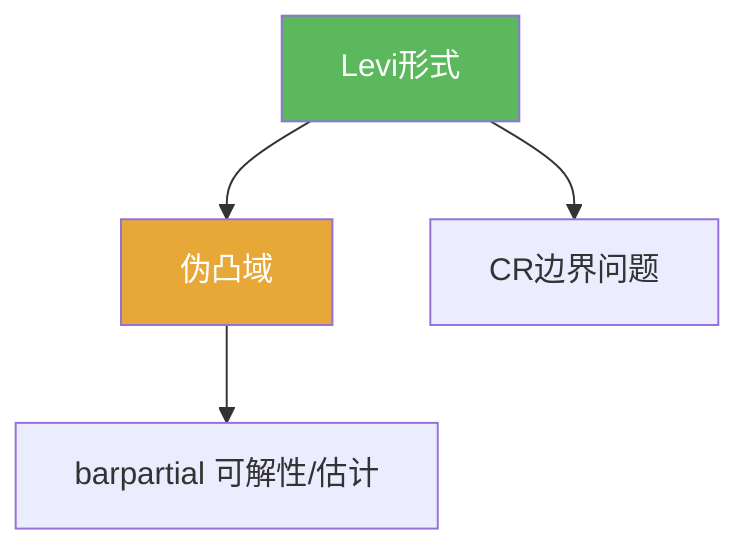

# Levi形式

> [!abstract] 概述
> ==Levi 形式==是多复变里“复意义下的二阶曲率”：它用定义函数的复二阶导数在复切向方向上的二次型来刻画伪凸性。  
> 本章把它当作几何判别器，用来解释延拓/可解性为什么需要域的条件。

## 定义（提示性）

> [!def] Levi形式（提示性）
> 设 $D=\{z:\rho(z)<0\}$ 且 $\rho$ 光滑。Levi 形式 $L_\rho$ 是 $\rho$ 的复 Hessian 在边界的复切向方向上的二次型（具体公式按教材口径）。

## 命题工具箱

| 性质/命题 | 表述 | 用途 |
|---|---|---|
| 伪凸判别 | Levi 半正（按教材定义） ⇒ 伪凸 | 域的几何开关 |
| 与 CR 关联 | Levi 在边界 CR 结构上自然出现 | 边界延拓的充分条件背景 |
| 与 barpartial 关联 | 许多 $\bar\partial$ 估计依赖伪凸/强伪凸 | 解释“为什么能解方程” |

## 关系网络

## 章节扩展

### 第07章：多复变引论

- Levi 与伪凸入口：[[7.5 Levi形式#二、核心思想]]
- 边界 CR 的几何背景：[[7.4 边界情形 切向Cauchy-Riemann方程#二、核心思想]]

## 补充

> [!info] 参考（权威外链）
> - https://en.wikipedia.org/wiki/Levi_form

## 参见

- [[伪凸域]]
- [[CR函数]]
- [[barpartial算子]]

