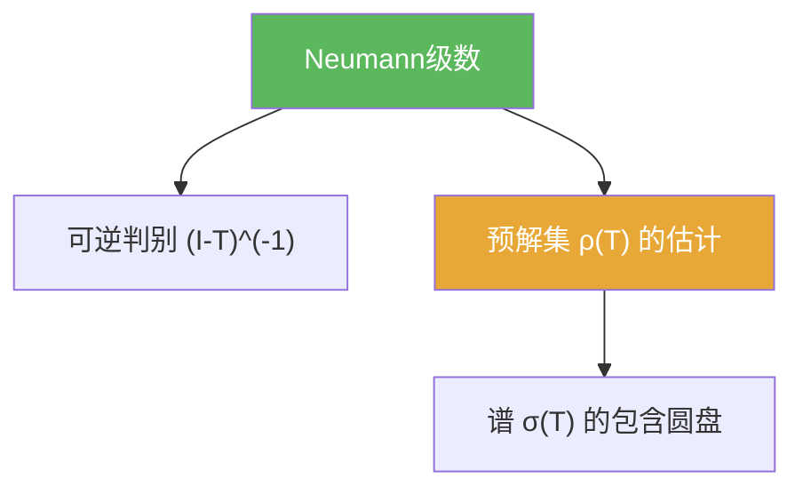

# Neumann级数

> [!abstract] 概述
> ==Neumann 级数==是 Banach 空间上最常用的可逆判别：当 $\|T\|<1$ 时，$I-T$ 可逆且逆可以写成几何级数 $\sum_{n\ge 0}T^n$。  
> 它同时给出对预解集与谱的直接估计。

## 定理表述

> [!def] Neumann 级数
> 若 $T\in B(X)$ 且 $\|T\|<1$，则
> $$(I-T)^{-1}=\sum_{n=0}^{\infty}T^n.$$

## 核心性质（命题工具箱）

| 性质/命题 | 表述（可直接引用） | 用途（做题时怎么用） |
|------|------|------|
| 几何级收敛 | 若 $\|T\|<1$，则 $\sum_{n\ge 0}T^n$ 在算子范数下收敛 | 给出显式逆算子表达式与误差估计 |
| 预解集判别模板 | $(T-\lambda I)^{-1}=-\lambda^{-1}\sum_{n\ge 0}(T/\lambda)^n$（当 $\|T/\lambda\|<1$） | 一步得到“$|\lambda|>\|T\|$ 都在预解集里” |
| 谱的圆盘估计 | 由上式推出 $\sigma(T)\subset\{|\lambda|\le \|T\|\}$ | 最常用的谱粗估计 |

## 典型例子与非例子

| 类型 | 例子 | 提醒 |
|---|---|---|
| 典型 | $\|T\|<1$ 时求 $(I-T)^{-1}$ | 这是 Banach 空间里的“几何级数” |
| 典型 | 用于证明 $\rho(T)$ 非空并给出外部圆盘 | 谱论做题的第一步常是找一片确定在预解集里的区域 |
| 非例子提醒 | $\|T\|\ge 1$ 时级数不保证收敛 | 需改用其它估计或把 $T$ 缩放到满足条件 |

## 关系网络

## 章节扩展

### 第02章：线性算子与线性泛函

- 2.6：以 Neumann 级数作为预解集判别与谱包含估计：[[2.6 线性算子的谱#二、核心思想]]

### 第03章：紧算子与Fredholm算子

- 3.3：紧算子谱结构中对 $I-\lambda^{-1}K$ 的可逆性判别：[[3.3 紧算子的谱理论#二、核心思想]]

## 补充

> [!info] 常见误区与来源
>
> - 误区：把 Neumann 级数当作“形式代数恒等式”。它是依赖于范数收敛的分析结论，关键条件是 $\|T\|<1$（或 $\|T/\lambda\|<1$）。  
> - 误区：忽略“在算子范数下收敛”的语境，导致推理链条断裂。
>
> **参考（权威外链）**
> - https://www.math.univ-toulouse.fr/~jroyer/TD/2022-23-M2/M2-Ch1.pdf  
> - http://v-v-kisil.scienceontheweb.net/courses/math3263m010.html

## 参见

- [[预解集]]
- [[谱]]
- [[谱半径]]
