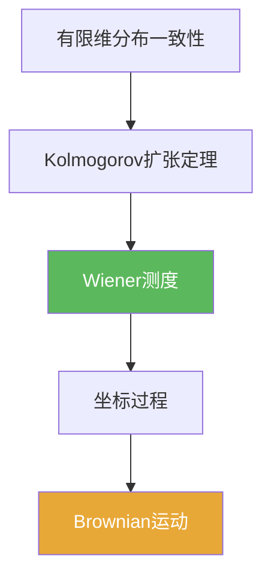

# Wiener测度

> [!abstract] 概述
> ==Wiener 测度==是定义在路径空间（典型为 $C([0,T])$ 或 $C([0,\infty))$）上的概率测度，使得“坐标过程”成为 Brownian 运动。  
> 它把“随机过程”落实为一个真正的测度对象：构造（6.3）就是在构建这件事。

## 定义

> [!def] Wiener 测度（提示性）
> 在 $C([0,T])$ 上存在概率测度 $\mathbb W$，使得坐标映射 $X_t(\omega)=\omega(t)$ 满足 Brownian 的有限维分布，并且路径连续性由空间本身保证。

## 核心性质（命题工具箱）

| 性质/命题 | 表述 | 用途 |
|---|---|---|
| 构造来源 | 一致有限维分布 + Kolmogorov 扩张 | 把网格分布拼成路径测度 |
| 连续性保证 | 通过连续性定理得到连续版本 | 解释“为何路径连续” |
| 坐标过程 | $X_t(\omega)=\omega(t)$ | 在路径空间上定义过程 |

## 关系网络

## 章节扩展

### 第06章：Brownian运动引论

- 构造主线：[[6.3 Brownian运动的构造#二、核心思想]]
- 技巧准备：[[6.2 技巧准备#二、核心思想]]

## 补充

> [!info] 参考（权威外链）
> - https://en.wikipedia.org/wiki/Wiener_measure

## 参见

- [[Brownian运动]]
- [[Kolmogorov扩张定理]]
- [[Kolmogorov连续性定理]]

