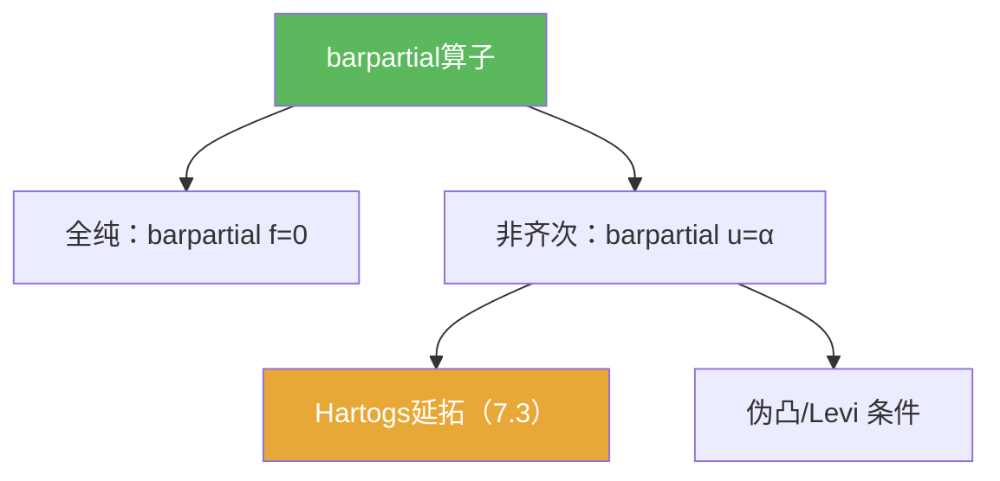

# barpartial算子

> [!abstract] 概述
> ==$\bar\partial$ 算子==是多复变的核心分析工具：全纯性可被表达为 $\bar\partial f=0$，而延拓/逼近/可解性问题往往转化为非齐次方程 $\bar\partial u=\alpha$ 的可解性与估计。

## 定义（提示性）

> [!def] $\bar\partial$（直觉口径）
> 把 $z=x+iy$ 分解为实部与虚部后，$\bar\partial$ 可以理解为“对 $\bar z$ 的导数方向”；当 $\bar\partial f=0$ 时，$f$ 是全纯函数。

## 命题工具箱

| 性质/命题 | 表述（可直接引用） | 用途 |
|---|---|---|
| 全纯判别 | $\bar\partial f=0$ | 把全纯性转成 PDE 条件 |
| 修正构造 | 构造 $F=\chi f-u$ 使 $\bar\partial F=0$ | Hartogs 延拓的核心步骤 |
| 几何依赖 | 可解性与域的伪凸/Levi 条件相关 | 解释为何需要几何开关 |

## 关系网络

## 章节扩展

### 第07章：多复变引论

- 非齐次 C-R 方程的使用姿势：[[7.3 Hartogs定理 非齐次Cauchy-Riemann方程#二、核心思想]]
- 边界 CR 的背景：[[7.4 边界情形 切向Cauchy-Riemann方程#二、核心思想]]

## 补充

> [!info] 参考（权威外链）
> - https://en.wikipedia.org/wiki/Dolbeault_operator

## 参见

- [[Hartogs现象]]
- [[Levi形式]]
- [[伪凸域]]
