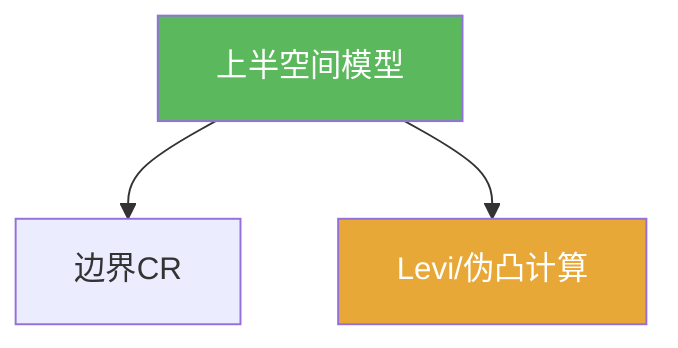

# 上半空间（多复变）

> [!abstract] 概述
> ==上半空间==在本章中作为标准模型域出现：许多边界问题（CR/Levi/伪凸）在该模型上更容易写出与计算，并可作为局部坐标化的目标。

## 定义（提示性）

> [!def] 上半空间（按教材）
> 多复变的上半空间是一个由“虚部为正”类型不等式定义的标准域（以教材具体定义为准）。

## 命题工具箱

| 性质/命题 | 表述 | 用途 |
|---|---|---|
| 标准模型 | 边界结构更显式 | 便于定义切向 CR、计算 Levi |
| 局部坐标化目标 | 把一般边界点附近变换到模型域 | 将一般问题化为标准问题 |
| 附录定位 | 作为工具箱而非主线定理 | 为 7.4–7.5 的理解服务 |

## 关系网络

## 章节扩展

### 第07章：多复变引论

- 附录 notes：[[7.8 附录 上半空间#二、核心思想]]

## 补充

> [!info] 参考（权威外链）
> - https://en.wikipedia.org/wiki/Upper_half-plane

## 参见

- [[CR函数]]
- [[Levi形式]]

