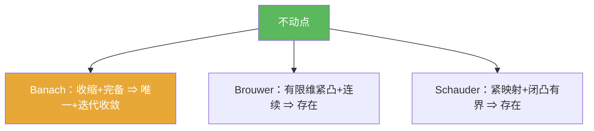

# 不动点

> [!abstract] 概述
> 对映射 $T$，满足 $Tx=x$ 的点称为==不动点==。大量“求解问题”都可以改写为不动点方程，从而用不动点定理证明存在性/唯一性。

## 定义

> [!def] 定义
> 给定映射 $T:X\to X$，若存在 $x\in X$ 使得 $Tx=x$，则称 $x$ 为 $T$ 的不动点。

## 核心性质（命题工具箱）

| 性质/命题 | 表述（可直接引用） | 用途（做题时怎么用） |
|------|------|------|
| 统一表述 | 解方程/解算子方程常可写成 $x=Tx$ | 把“求解”变为“找不动点”，便于用定理 |
| 三条典型路线 | Banach：收缩+完备 $\Rightarrow$ 唯一；Brouwer：有限维紧凸+连续 $\Rightarrow$ 存在；Schauder：紧映射+闭凸有界 $\Rightarrow$ 存在 | 先匹配“空间假设/映射假设”，再选用对应定理 |
| 迭代构造性 | 对收缩映射，Picard 迭代 $x_{n+1}=Tx_n$ 收敛到不动点 | 给出“存在”同时给出“可计算逼近” |

## 典型例子与非例子

| 类型 | 例子 | 提醒 |
|---|---|---|
| 典型 | 常值映射 $T(x)=x_0$：不动点是 $x_0$ | 不动点可能很容易识别 |
| 典型（收缩） | $\mathbb{R}$ 上 $T(x)=\frac12 x$：唯一不动点 0 | 收缩映射是最“可控”的场景 |
| 非例子提醒 | 连续映射不一定有不动点 | 需要额外结构（紧/凸/完备/紧性条件） |

## 关系网络

## 章节扩展

### 第01章：度量空间

- 1.1：压缩映射原理（不动点方程的构造性解法）：[[1.1 压缩映射原理#二、核心思想]]
- 1.5：凸性/紧性框架下的不动点存在性：[[1.5 凸集与不动点#二、核心思想]]

## 补充

> [!info] 常见误区与来源
>
> - 误区：把“存在不动点”当作普遍事实。没有完备/紧/凸等结构时，不动点可能不存在。  
> - 误区：忽略“构造性 vs 非构造性”的区别。Banach 不动点定理往往给出迭代收敛；Brouwer/Schauder 多为存在性结论。
>
> **参考（权威外链）**
> - CUHK Chapter 3 Contraction Mapping Principle（含 fixed point 基本定义与 Banach 原理）：https://www.math.cuhk.edu.hk/course_builder/2425/math3060/Chapter%203%20Contraction%20Mapping%20Prinicple%202024.pdf
> - Wikipedia: Fixed point (mathematics): https://en.wikipedia.org/wiki/Fixed_point_(mathematics)

## 参见

- [[Banach不动点定理]]
- [[Brouwer不动点定理]]
- [[Schauder不动点定理]]
