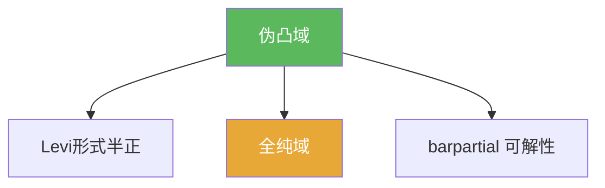

# 伪凸域

> [!abstract] 概述
> ==伪凸域==是多复变中与全纯结构最相容的“凸性”概念：它通常由 Levi 形式的半正性判别，并与“哪些域是全纯域/哪些域允许强逼近与延拓”密切相关。

## 定义（提示性）

> [!def] 伪凸（提示性）
> 在光滑边界情形下，伪凸可由 Levi 形式半正来表达（精确定义与等价刻画以教材为准）。

## 命题工具箱

| 性质/命题 | 表述 | 用途 |
|---|---|---|
| Levi 判别 | Levi 半正 ⇒ 伪凸 | 把几何问题转成符号问题 |
| 与全纯域关联 | 伪凸性常与“全纯域”等价或密切相关 | 解释延拓边界 |
| 与 barpartial 关联 | 伪凸提供许多 $\bar\partial$ 可解性的充分条件 | 支撑 Hartogs/逼近/延拓工具链 |

## 关系网络

## 章节扩展

### 第07章：多复变引论

- 几何入口：[[7.5 Levi形式#二、核心思想]]
- 逼近与延拓的结构背景：[[7.7 逼近和延拓定理#二、核心思想]]

## 补充

> [!info] 参考（权威外链）
> - https://en.wikipedia.org/wiki/Pseudoconvexity

## 参见

- [[Levi形式]]
- [[全纯域]]
- [[barpartial算子]]

