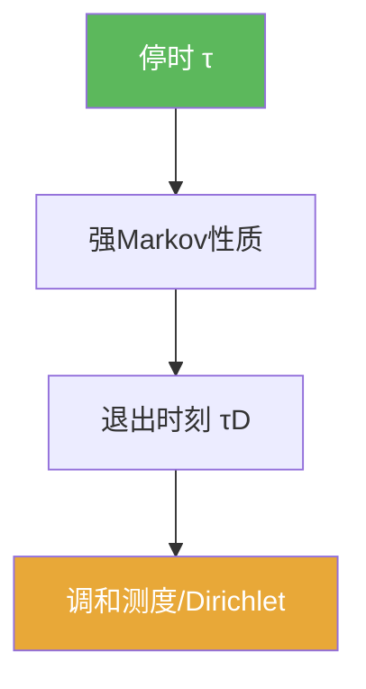

# 停时

> [!abstract] 概述
> ==停时==是“可在当下决定是否停下”的随机时刻：事件 $\{\tau\le t\}$ 只依赖 $\mathcal F_t$。  
> 它是强 Markov 性质可用的精确边界：只有停时才能保证“重启”不偷看未来。

## 定义

> [!def] 停时
> 相对于滤过 $\{\mathcal F_t\}$，若对任意 $t$，
> $$\{\tau\le t\}\in\mathcal F_t,$$
> 则称 $\tau$ 为停时。

## 核心性质（命题工具箱）

| 性质/命题 | 表述 | 用途 |
|---|---|---|
| 首达时是停时 | $\tau_a=\inf\{t:B_t=a\}$ | 处理最大值/首达时 |
| 退出时刻是停时 | $\tau_D=\inf\{t:B_t\notin D\}$ | Dirichlet 概率表示 |
| 强 Markov 前提 | 停时 + 自然滤过 | 允许在 $\tau$ 处重启 |

## 关系网络

## 章节扩展

### 第06章：Brownian运动引论

- 停时与强 Markov 主线：[[6.5 停时和强Markov性质#二、核心思想]]
- Dirichlet 的退出时刻：[[6.6 Dirichlet问题的解#二、核心思想]]

## 补充

> [!info] 参考（权威外链）
> - https://en.wikipedia.org/wiki/Stopping_time

## 参见

- [[滤过]]
- [[强Markov性质]]

