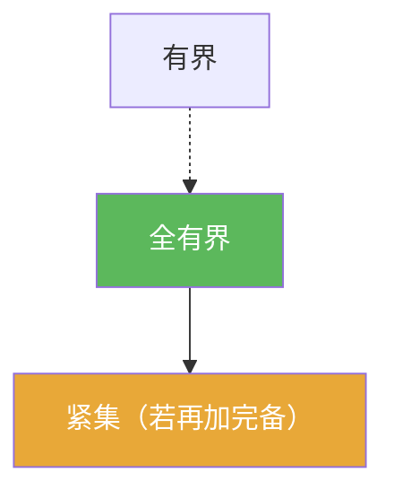

# 全有界

> [!abstract] 概述
> ==全有界==比“有界”更强：不仅能被一个大球包住，而且能在任意精度下用有限个小球覆盖。  
> 在度量空间里，它与完备性配合给出紧性判别：紧 $\Leftrightarrow$ 完备 + 全有界。

## 定义

> [!def] 定义
> 度量空间 $(X,d)$ 中集合 $E$ 称为全有界：对任意 $\varepsilon>0$，存在有限个点 $x_1,\dots,x_N$ 使得
> $$E\subset \bigcup_{i=1}^{N} B(x_i,\varepsilon).$$

## 核心性质（命题工具箱）

| 性质/命题 | 表述（可直接引用） | 用途（做题时怎么用） |
|------|------|------|
| 强于有界 | 全有界 $\Rightarrow$ 有界；反之一般不成立 | 处理无限维问题时的“有限覆盖”条件 |
| 紧性判别 | 若 $E$ 完备且全有界，则 $E$ 紧 | 常见套路：先证闭（从而完备），再证全有界 |
| 子列抽取 | 在度量空间中：全有界 $\Rightarrow$ 任意序列有 Cauchy 子列 | 与完备性组合得到收敛子列，从而推出列紧/紧 |

## 典型例子与非例子

| 类型 | 例子 | 提醒 |
|---|---|---|
| 全有界 | $\mathbb{R}^n$ 中有界集 | 有限维里“有界”就能用有限个小球覆盖 |
| 全有界 | $[0,1]$ | 任意精度下可用有限个区间覆盖 |
| 非全有界 | 无限维赋范空间的闭单位球（典型情形） | 这是“无限维非紧”现象的核心来源之一 |

## 关系网络

## 章节扩展

### 第01章：度量空间

- 1.3：紧 ⇔ 完备 + 全有界（核心判别）：[[1.3 列紧集#二、核心思想]]

## 补充

> [!info] 常见误区与来源
>
> - 误区：把“全有界”当作“有界”。全有界是“任意精度有限覆盖”，比“存在一个大球能包住”强得多。  
> - 误区：把“全有界”直接等同于“紧”。在度量空间里还需要完备性（例如闭集/完备子空间）才能推出紧。
>
> **参考（权威外链）**
> - MIT 18.S190 Lecture 4（含 totally bounded 与 compact 的关系）：https://ocw.mit.edu/courses/18-s190-introduction-to-metric-spaces-january-iap-2023/mit18_s190iap23_lec4.pdf
> - Wikipedia: Totally bounded space: https://en.wikipedia.org/wiki/Totally_bounded_space

## 参见

- [[紧集]]
- [[列紧]]
