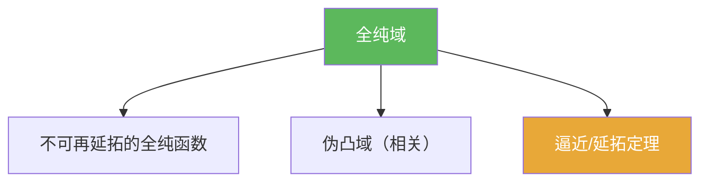

# 全纯域

> [!abstract] 概述
> ==全纯域==刻画“延拓机制的边界”：在这样的域上，存在全纯函数无法再延拓到任何更大的域。  
> 因此它是“逼近/延拓”讨论中的终点概念：告诉你哪些域已经“最大化”了全纯结构。

## 定义（提示性）

> [!def] 全纯域（直觉表述）
> 域 $D$ 称为全纯域，如果存在 $f$ 全纯于 $D$ 且 $f$ 不能全纯延拓到任何严格包含 $D$ 的域（精确定义以教材为准）。

## 命题工具箱

| 性质/命题 | 表述 | 用途 |
|---|---|---|
| 延拓边界 | “存在不可延拓函数” | 解释为何某些洞不可去 |
| 与伪凸关联 | 在经典理论中，全纯域与伪凸往往深度相关 | 将几何条件与全局结构联系起来 |
| 与逼近关联 | 逼近/延拓定理常以全纯域作为自然舞台 | 7.7 的结构背景 |

## 关系网络

## 章节扩展

### 第07章：多复变引论

- 全局机制入口：[[7.7 逼近和延拓定理#二、核心思想]]
- 结构边界感：[[7.10 问题#二、核心思想]]

## 补充

> [!info] 参考（权威外链）
> - https://en.wikipedia.org/wiki/Domain_of_holomorphy

## 参见

- [[伪凸域]]
- [[全纯逼近]]
- [[延拓定理（多复变）]]

