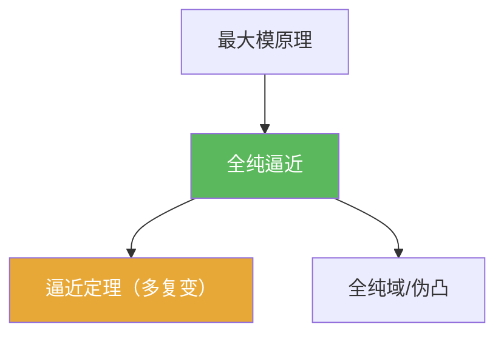

# 全纯逼近

> [!abstract] 概述
> ==全纯逼近==关注：在什么条件下，可以用全纯函数序列在某种意义（常见为一致逼近）逼近给定函数。  
> 它是把“局部信息”升级为“全局构造”的重要机制，并常与全纯域/伪凸几何以及最大模控制相配合。

## 定义（口径提示）

> [!def] 全纯逼近（直觉表述）
> 给定集合 $K$ 与函数 $f$，若存在全纯函数列 $f_n$ 使 $f_n\to f$ 在 $K$ 上按指定意义收敛，则称 $f$ 可被全纯逼近。

## 命题工具箱

| 性质/命题 | 表述 | 用途 |
|---|---|---|
| 一致逼近是常见口径 | $\sup_{z\in K}|f_n(z)-f(z)|\to 0$ | 适合构造型题目 |
| 结构条件重要 | $K/D$ 的几何性质决定是否可逼近 | 多复变“几何开关” |
| 与最大模配合 | 最大模常用于控制逼近误差与收口 | 证明中的估计工具 |

## 关系网络

## 章节扩展

### 第07章：多复变引论

- 本章主线入口：[[7.7 逼近和延拓定理#二、核心思想]]

## 补充

> [!info] 参考（权威外链）
> - https://en.wikipedia.org/wiki/Oka%E2%80%93Weil_theorem

## 参见

- [[逼近定理（多复变）]]
- [[全纯域]]
- [[最大模原理（多复变）]]

