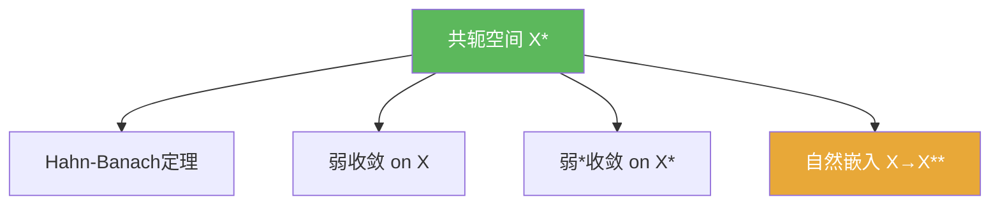

# 共轭空间

> [!abstract] 概述
> ==共轭空间==（也常称对偶空间）$X^\*$ 是赋范空间 $X$ 上全体连续线性泛函的集合。它既是“测试函数集合”（定义弱/弱*收敛），也是“分离工具”（Hahn–Banach），还是后续谱论与对偶性理论的基础对象。

## 定义

> [!def] 定义
> 设 $X$ 为赋范空间。定义
> $$X^\*:=\{f:X\to\mathbb{F}\mid f\ \text{线性且连续}\}.$$
> 并赋予范数
> $$\|f\|:=\sup_{\|x\|\le 1}|f(x)|.$$

## 核心性质（命题工具箱）

| 性质/命题 | 表述（可直接引用） | 用途（做题时怎么用） |
|------|------|------|
| 完备性 | $(X^*,\|\cdot\|)$ 总是 Banach | 允许在对偶里做极限/级数与算子论 |
| 分离工具 | Hahn–Banach 使 $X^*$ 足够丰富，可分离点/凸集 | 证明“存在泛函使得…”，是对偶化的第一步 |
| 弱拓扑测试族 | $x_n\rightharpoonup x \iff \forall f\in X^*:\ f(x_n)\to f(x)$ | 弱收敛几乎总是“逐个泛函测试”来证（见 [[弱收敛]]) |
| 弱*拓扑测试族 | $f_n\overset{w^*}{\to}f \iff \forall x\in X:\ f_n(x)\to f(x)$ | 处理对偶单位球的紧性（Banach–Alaoglu）时的标准语言 |

## 典型例子与非例子

| 类型 | 例子 | 提醒 |
|---|---|---|
| 典型 | $\mathbb{R}^n$ 的对偶同构于自身 | 有限维里“对偶化”不会引入新现象 |
| 典型 | $H$ Hilbert，则 $H^*\cong H$（Riesz） | 在 Hilbert 中对偶可以“具体化为向量” |
| 非例子提醒 | “所有线性泛函”并不等于 $X^*$ | 在范数空间里 $X^*$ 默认只指**连续**线性泛函 |

## 关系网络

## 章节扩展

### 第02章：线性算子与线性泛函

- 2.4：Hahn–Banach 的延拓保证对偶足够丰富：[[2.4 Hahn-Banach定理#二、核心思想]]
- 2.5：弱/弱*拓扑与自反性：[[2.5 共轭空间 弱收敛 自反空间#二、核心思想]]

## 补充

> [!info] 常见误区与来源
>
> - 误区：把 $X^*$ 当成“所有线性泛函”。本书语境下 $X^*$ 是连续线性泛函，否则无法定义对偶范数与弱拓扑。  
> - 误区：忽略“范数/拓扑”的角色，只用代数线性空间直觉理解对偶，容易在无限维出错。
>
> **参考（权威外链）**
> - https://www.imo.universite-paris-saclay.fr/~joseph.feneuil/Cours/Functional_Analysis.pdf  
> - https://ocw.mit.edu/courses/18-102-introduction-to-functional-analysis-spring-2021/06f9cf855f9f5eaa1898f3e684e05cec_MIT18_102s21_lec5.pdf

## 参见

- [[线性泛函]]
- [[Hahn-Banach定理]]
- [[弱收敛]]
- [[弱*收敛]]
- [[自反空间]]
