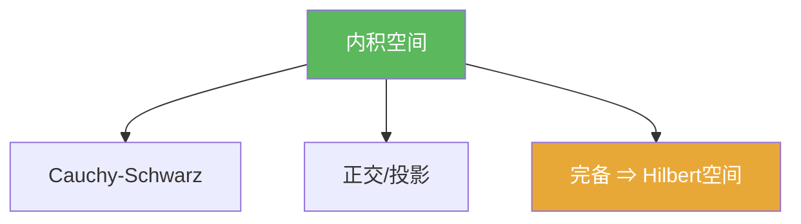

# 内积空间

> [!abstract] 概述
> ==内积空间==为向量空间提供“角度/正交”的几何结构；并且内积诱导范数与度量，使得我们可以用距离语言做极限与逼近。  
> 一旦再加入完备性，就得到 Hilbert空间；这也是第二章 Riesz 表示、投影/最小化与谱论最常工作的环境。

## 定义

> [!def] 定义
> 线性空间 $H$ 上的映射 $\langle\cdot,\cdot\rangle$ 若满足共轭对称、线性（按约定）、正定性，则称 $H$ 为内积空间。

## 核心性质（命题工具箱）

| 性质/命题 | 表述（可直接引用） | 用途（做题时怎么用） |
|------|------|------|
| 诱导范数 | $\|x\|=\sqrt{\langle x,x\rangle}$ | 把几何结构转成可计算的长度；进而得到度量 |
| Cauchy–Schwarz | $|\langle x,y\rangle|\le \|x\|\|y\|$ | 推出三角不等式、连续性估计；见 [[Cauchy-Schwarz不等式]] |
| 正交判别 | $x\perp y \iff \langle x,y\rangle=0$ | 误差分解、投影、最小化问题的核心条件（见 [[正交]]） |

## 典型例子与非例子

| 类型 | 例子 | 提醒 |
|---|---|---|
| 典型 | $\mathbb{R}^n$ 的点积 | 最熟悉的几何模型 |
| 典型 | $L^2(\Omega)$ 的积分内积 $\langle f,g\rangle=\int f\overline g$ | 以等价类定义，细节在 Hilbert 理论中处理 |
| 非例子 | 一般赋范空间不一定来自内积 | 是否来自内积可用平行四边形恒等式判别（见 [[Hilbert空间]]) |

## 关系网络

## 章节扩展

### 第01章：度量空间

- 1.6：内积空间与 Hilbert 空间入口：[[1.6 内积空间#二、核心思想]]

## 补充

> [!info] 常见误区与来源
>
> - 误区：把“内积诱导范数”当作“任意范数都来自某个内积”。一般赋范空间并不来自内积。  
> - 误区：把“内积空间”自动当作“Hilbert空间”。完备性是额外条件。
>
> **参考（权威外链）**
> - IITG MA641 lecture notes（Hilbert/投影等工具链）：https://fac.iitg.ac.in/rksri/MA641%20Operator%20Theory%20in%20Hilbert%20Spaces%20lecturenotes%202020.pdf
> - Wikipedia: Inner product space: https://en.wikipedia.org/wiki/Inner_product_space

## 参见

- [[Hilbert空间]]
- [[正交]]
- [[Cauchy-Schwarz不等式]]
