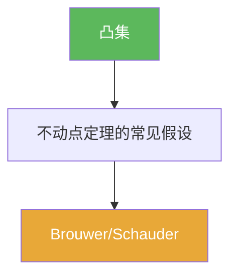

# 凸集

> [!abstract] 概述
> ==凸集==是在向量空间中对“线段闭合”的抽象：任意两点之间的线段仍留在集合内。  
> 在泛函分析里，凸性最常作为“不动点/分离/极值存在”的几何前提出现：它让“平均/迭代/逼近”在集合内保持可行。

## 定义

> [!def] 定义
> 在线性空间 $X$ 中，集合 $K\subset X$ 称为凸的：对任意 $x,y\in K$、任意 $t\in[0,1]$，
> $$tx+(1-t)y\in K.$$

## 核心性质（命题工具箱）

| 性质/命题 | 表述（可直接引用） | 用途（做题时怎么用） |
|------|------|------|
| 线段闭合 | $x,y\in K,\ t\in[0,1]\Rightarrow tx+(1-t)y\in K$ | 证明凸性通常只需验证“任意两点的线段” |
| 交保持凸性 | 若 $K_i$ 均凸，则 $\cap_i K_i$ 仍凸 | 构造可行域/约束集时常用 |
| 仿射像保持凸性 | 若 $K$ 凸且 $A$ 线性、$b$ 固定，则 $AK+b$ 凸 | 做变量替换/投影/线性算子作用时常用 |

## 典型例子与非例子

| 类型 | 例子 | 提醒 |
|---|---|---|
| 凸集 | 线性子空间、闭球 $\overline{B(x_0,r)}$ | 闭球凸性来自三角不等式 |
| 凸集 | 半空间 $\{x:\ f(x)\le c\}$（$f$ 线性泛函） | Hahn–Banach 分离工具的几何背景 |
| 非凸集 | “环形区域” $\{x:\ 1<\|x\|<2\}$ | 两点连线会穿过内孔 |

## 关系网络

## 章节扩展

### 第01章：度量空间

- 1.5：凸集与不动点理论的入口：[[1.5 凸集与不动点#二、核心思想]]

## 补充

> [!info] 常见误区与来源
>
> - 误区：把“凸”当作“连通/无洞”。凸 $\Rightarrow$ 连通，但反过来不成立。  
> - 误区：只在 $\mathbb{R}^n$ 直觉下理解凸性；在无限维里凸性仍是“线段闭合”，但与紧性/极值等现象的关系会更微妙。
>
> **参考（权威外链）**
> - Vandenberghe (UCLA) Convex sets notes: https://seas.ucla.edu/~vandenbe/ee236b/lectures/sets.pdf
> - Wikipedia: Convex set: https://en.wikipedia.org/wiki/Convex_set

## 参见

- [[不动点]]
- [[Schauder不动点定理]]
