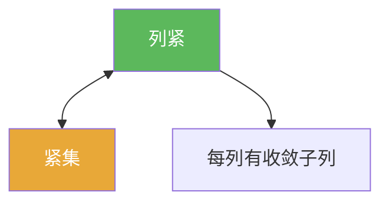

# 列紧

> [!abstract] 概述
> ==列紧==从序列角度刻画紧性：每个序列都有收敛子列。  
> 在度量空间里它与“紧（开覆盖）”等价，因此做题时往往把“紧”直接替换成“列紧”来用（尤其是处理序列/函数列）。

## 定义

> [!def] 定义
> $K\subset X$ 称为列紧：对任意序列 $(x_n)\subset K$，存在子列 $(x_{n_k})$ 收敛到某点 $x\in K$。

## 核心性质（命题工具箱）

| 性质/命题 | 表述（可直接引用） | 用途（做题时怎么用） |
|------|------|------|
| 度量空间等价 | 在度量空间中：列紧 $\Leftrightarrow$ 紧 | 证明紧性时可直接转为“取任意序列” |
| 推论链 | 列紧 $\Rightarrow$ 有界；并推出“完备 + 全有界” | 与 [[紧集]] 的判别互相呼应 |
| 子列抽取技巧 | 证明列紧常用：对任意序列抽子列，使其满足 Cauchy/收敛 | 与全有界（有限覆盖）配合，常能抽出 Cauchy 子列 |

## 典型例子与非例子

| 类型 | 例子 | 提醒 |
|---|---|---|
| 列紧 | $[0,1]\subset\mathbb{R}$ | 任意序列都有收敛子列（Bolzano–Weierstrass） |
| 非列紧 | $(0,1)$ | 可取 $x_n=1/n$，极限不在集合内 |
| 非列紧 | 无限集合的离散度量空间 | 任何序列都无法抽出收敛子列（除非最终常值） |

## 关系网络

## 章节扩展

### 第01章：度量空间

- 1.3：列紧集的性质与紧性判别：[[1.3 列紧集#二、核心思想]]

## 补充

> [!info] 常见误区与来源
>
> - 误区：把“列紧”当作一般拓扑空间里的“紧”。列紧与紧在一般拓扑空间不等价；但在度量空间里等价，这是本章能大量用序列方法的关键。  
> - 误区：忽略“极限要落在集合里”的条件（例如 $(0,1)$ 不是列紧）。
>
> **参考（权威外链）**
> - UCLA notes: Compactness and Topology（含 sequential compactness 的讨论）：https://www.math.ucla.edu/~biskup/131ah.1.23w/PDFs/ch20.pdf
> - Wikipedia: Sequentially compact space: https://en.wikipedia.org/wiki/Sequentially_compact_space

## 参见

- [[紧集]]
- [[全有界]]
