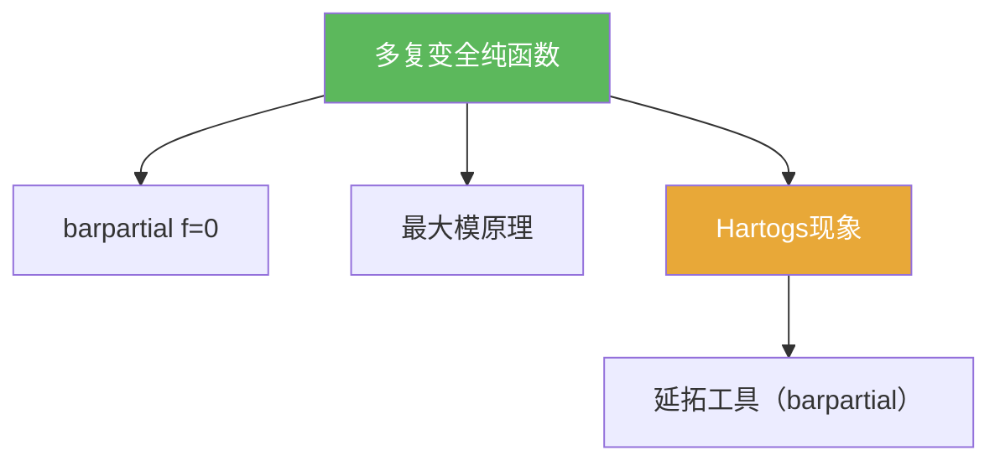

# 多复变全纯函数

> [!abstract] 概述
> ==多复变全纯函数==是定义在 $\mathbb C^n$（$n\ge 2$）上的全纯函数。  
> 与一复变相比，它们在延拓、可去奇性、以及几何条件依赖上呈现显著不同（Hartogs 现象、伪凸/Levi 等）。

## 定义（提示性）

> [!def] 全纯（多复变）
> 在域 $\Omega\subset\mathbb C^n$ 上，$f:\Omega\to\mathbb C$ 若满足教材给出的等价定义之一，则称 $f$ 全纯。常用口径之一是
> $$\bar\partial f=0.$$

## 命题工具箱

| 性质/命题 | 表述 | 用途 |
|---|---|---|
| barpartial 判别 | $\bar\partial f=0$ | 把全纯性转成 PDE 条件 |
| Hartogs 反直觉 | $n\ge 2$ 时出现可去洞现象 | 多复变与一维差异入口 |
| 最大模原理 | 内部局部最大 ⇒ 常数 | 常见收口工具 |

## 关系网络

## 章节扩展

### 第07章：多复变引论

- 初等性质入口：[[7.1 初等性质#二、核心思想]]
- 现象与定理：[[7.2 Hartogs现象 一个例子#二、核心思想]]、[[7.3 Hartogs定理 非齐次Cauchy-Riemann方程#二、核心思想]]
- 最大模收口：[[7.6 最大模原理#二、核心思想]]

## 补充

> [!info] 参考（权威外链）
> - https://en.wikipedia.org/wiki/Holomorphic_function

## 参见

- [[barpartial算子]]
- [[Hartogs现象]]
- [[最大模原理（多复变）]]

