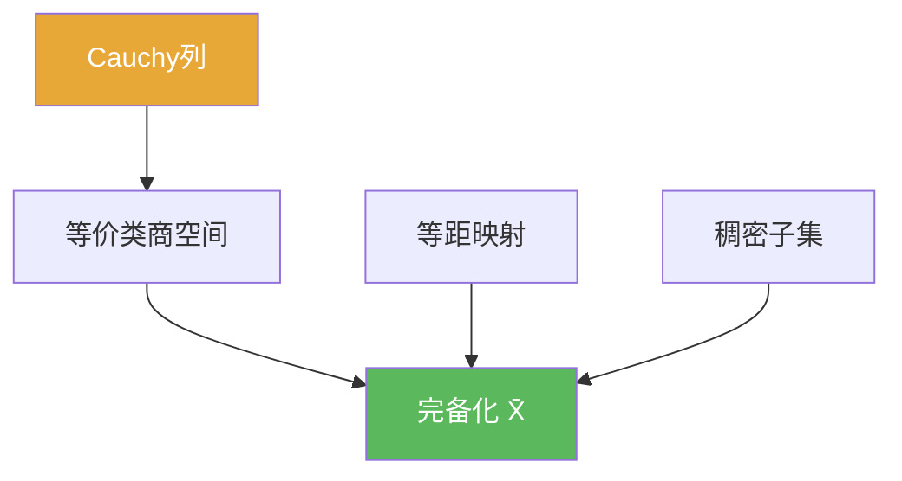

# 完备化

> [!abstract] 概述
> ==完备化==把一个可能“不完备”的度量空间补全为完备空间：让每个 Cauchy 列的“应有极限”都真正存在于新空间中。  
> 做题时它提供一个常用套路：先在完备化里取极限/做收敛，再把结论“拉回”原空间（通常通过等距嵌入与稠密性）。

## 定义

> [!def] 定义（口径）
> 若存在完备度量空间 $(\overline{X},\overline{d})$ 与等距嵌入 $i:(X,d)\to(\overline{X},\overline{d})$，并且 $i(X)$ 在 $\overline{X}$ 中稠密，则称 $(\overline{X},\overline{d})$ 为 $(X,d)$ 的 **完备化**。

## 核心性质（命题工具箱）

| 性质/命题 | 表述（可直接引用） | 用途（做题时怎么用） |
|------|------|------|
| 存在性 | 任意度量空间 $(X,d)$ 都存在完备化 | 允许把问题转移到完备空间处理 |
| 唯一性（同构意义） | 任意两个完备化在等距同构意义下唯一 | 不用纠结构造细节：结论与选择的完备化无关 |
| 构造主线 | 用 Cauchy 列的等价类构造 $\overline{X}$，距离取极限 $\overline d([\!x_n\!],[\!y_n\!])=\lim d(x_n,y_n)$ | 做证明时常要验证：良定义、嵌入等距、像集稠密、空间完备 |
| 稠密性角色 | $i(X)$ 稠密确保“没有新增‘空洞’以外的点” | 让新点都可由旧点逼近，符合“补全”的直觉 |

## 典型例子与非例子

| 类型 | 例子 | 提醒 |
|---|---|---|
| 完备化例子 | $\mathbb{Q}$ 的完备化是 $\mathbb{R}$（欧氏度量） | Cauchy 列逼近 $\sqrt2$ 的极限在 $\mathbb{Q}$ 外 |
| 完备化例子 | 任意赋范空间的完备化是其 Banach 空间闭包 | 这就是“Banach 化”的抽象来源（见 [[Banach空间]]) |
| 非例子（不够） | 仅把 $X$ 放进某个完备空间里，但像集不稠密 | 这只是嵌入，不是“补全” |

## 关系网络

## 章节扩展

### 第01章：度量空间

- 1.2：系统讲解完备化的定义、稠密与构造：[[1.2 完备化#二、核心思想]]

## 补充

> [!info] 常见误区与来源
>
> - 误区：把“嵌入到完备空间”当作“完备化”。完备化还要求 $i(X)$ **稠密**，否则新增点不一定是“填空洞”。  
> - 误区：把“完备化”理解成“加上所有极限点”。在一般度量空间里，正确对象是“Cauchy 列等价类”，不是仅靠拓扑闭包就能说明。
>
> **参考（权威外链）**
> - Completion of a Metric Space（含 Cauchy 列等价类构造）：https://math.soimeme.org/~arunram/Teaching/2022MetricHilbert/Completions220719.pdf
> - Wikipedia: Completion (metric space): https://en.wikipedia.org/wiki/Completion_(metric_space)

## 参见

- [[完备度量空间]]
- [[稠密子集]]
- [[等距映射]]
