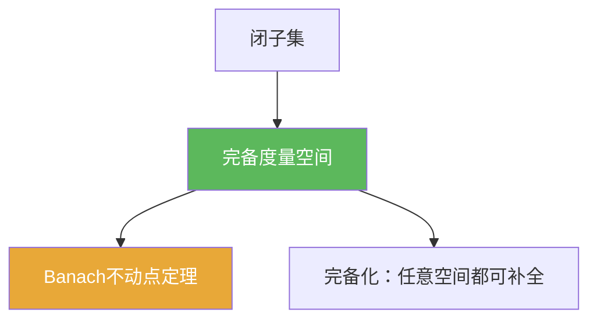

# 完备度量空间

> [!abstract] 概述
> ==完备度量空间==是“极限不缺失”的度量空间：每个 Cauchy 列都在空间内收敛。  
> 很多分析结论的证明套路是：先把对象构造成 Cauchy（通过估计/迭代），再用完备性把“趋近”升级成“确实存在的极限”。

## 定义

> [!def] 定义
> 度量空间 $(X,d)$ 若满足：任意 Cauchy 列 $(x_n)$ 都收敛于某个 $x\in X$，则称 $(X,d)$ **完备**（或称 $X$ 在度量 $d$ 下完备）。

## 核心性质（命题工具箱）

| 性质/命题 | 表述（可直接引用） | 用途（做题时怎么用） |
|------|------|------|
| 收敛与 Cauchy 的关系 | 任意度量空间：收敛 $\Rightarrow$ Cauchy；完备空间：Cauchy $\Rightarrow$ 收敛 | 判断“缺的到底是估计还是空间本身不完备” |
| 闭子集继承完备 | 若 $X$ 完备且 $F\subset X$ 闭，则 $F$ 在继承度量下完备 | 常用于把问题限制在闭子空间/闭球内 |
| 完备性依赖度量 | 同一集合可在不同等价度量下“完备/不完备” | 写反例时常用：说明完备不是纯拓扑性质（在一般情形下） |
| 与压缩映射 | 完备 + 压缩 $\Rightarrow$ 唯一不动点（Banach 不动点定理） | 迭代法（Picard 迭代）存在唯一性证明的核心前提 |

## 典型例子与非例子

| 类型 | 例子 | 提醒 |
|---|---|---|
| 完备 | $(\mathbb{R}^n,\|\cdot\|)$ | 有限维范数等价且都完备 |
| 不完备 | $(\mathbb{Q},|\cdot|)$ | Cauchy 序列可以收敛到 $\mathbb{R}\setminus\mathbb{Q}$ |
| 完备（闭子集） | $[0,1]\subset\mathbb{R}$ | 闭子集继承完备性 |

## 关系网络

## 章节扩展

### 第01章：度量空间

- 1.1：压缩映射原理的核心假设之一：[[1.1 压缩映射原理#二、核心思想]]
- 1.2：任意度量空间都可构造完备化：[[1.2 完备化#二、核心思想]]

## 补充

> [!info] 常见误区与来源
>
> - 误区：把“闭且有界”当作完备条件。完备性与紧性相关，但并非等价（例如无限维中闭有界并不紧）。  
> - 误区：忘记检查“极限是否仍在空间里”（典型：$\mathbb{Q}$ 中的 Cauchy 列）。
>
> **参考（权威外链）**
> - UCLA 131AH Notes, Chapter 17 Completeness: https://www.math.ucla.edu/~biskup/131ah.1.23w/PDFs/ch17.pdf
> - Wikipedia: Complete metric space: https://en.wikipedia.org/wiki/Complete_metric_space

## 参见

- [[Cauchy列]]
- [[Banach空间]] — “完备 + 线性结构”的版本
