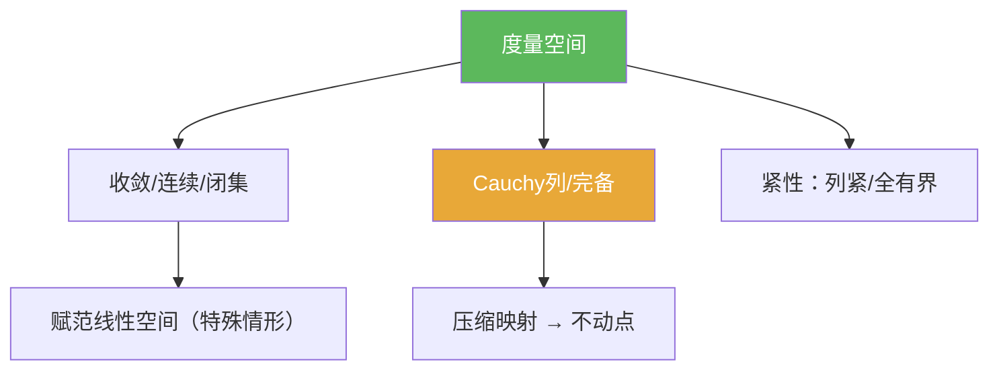

# 度量空间

> [!abstract] 概述
> ==度量空间==用“距离” $d(x,y)$ 在抽象集合上刻画“靠近/收敛/连续”。  
> 在泛函分析中，很多看似“线性”的问题最终都要回到度量语言：我们要控制的往往是“误差的大小（距离）”，以及“极限过程是否稳定（完备/紧性）”。

## 定义

> [!def] 度量空间
>
> 给定非空集合 $X$。若映射 $d:X\times X\to \mathbb{R}$ 满足对任意 $x,y,z\in X$：
>
> 1)（非负与分离）$d(x,y)\ge 0$，且 $d(x,y)=0\Leftrightarrow x=y$  
> 2)（对称）$d(x,y)=d(y,x)$  
> 3)（三角不等式）$d(x,z)\le d(x,y)+d(y,z)$  
>
> 则称 $(X,d)$ 为 **度量空间**。

## 核心性质（命题工具箱）

| 性质/命题 | 表述（可直接引用） | 用途（做题时怎么用） |
|------|------|------|
| 收敛 | $x_n\to x \iff d(x_n,x)\to 0$ | 把“极限”转成距离估计；证明收敛通常就是给出 $d(x_n,x)\to 0$ |
| Cauchy 列 | $(x_n)$ Cauchy $\iff \forall\varepsilon>0\,\exists N\,\forall m,n\ge N:\ d(x_n,x_m)<\varepsilon$ | 判断“序列是否应该收敛”；完备性用它来封闭极限过程（见 [[完备度量空间]]) |
| 连续（序列刻画） | $f$ 连续 $\Rightarrow x_n\to x \implies f(x_n)\to f(x)$（在度量空间里也可反推） | 做题时常用：用“把收敛序列送到收敛序列”来检验连续性 |
| 紧性判别（度量情形） | 紧 $\Leftrightarrow$ 列紧；紧 $\Leftrightarrow$ 完备 + 全有界 | 把“抽象紧性”变成可操作条件（见 [[紧集]] [[列紧]] [[全有界]]) |

## 典型例子与非例子

| 类型 | 例子 | 提醒 |
|---|---|---|
| 典型 | $(\mathbb{R}^n,\|x-y\|_2)$ | 来自范数的度量是泛函分析最常用的情形 |
| 典型 | 离散度量 $d(x,y)=\mathbf{1}_{x\ne y}$ | “所有点彼此等远”，序列收敛结构非常简单 |
| 典型 | 赋范空间 $(X,\|\cdot\|)$ 诱导度量 $d(x,y)=\|x-y\|$ | 连接线性结构与度量结构（见 [[范数诱导度量]]) |
| 非例子 | $d(x,y)=|x-y|^2$（在 $\mathbb{R}$ 上） | 一般不满足三角不等式，因此不是度量 |

## 关系网络

## 章节扩展

### 第01章：度量空间

- 1.1 给出度量空间基本定义，并引出压缩映射原理：[[1.1 压缩映射原理#二、核心思想]]
- 1.2 讨论完备性不足时的“补全”思想：[[1.2 完备化#二、核心思想]]
- 1.3 讨论紧性/列紧与判别：[[1.3 列紧集#二、核心思想]]

## 补充

> [!info] 常见误区与来源
>
> - 误区：把“距离函数”都当作度量。做题时一定要逐条核对三角不等式（最容易失败）。  
> - 误区：把“度量空间的紧”理解成“有界 + 闭”。这是 $\mathbb{R}^n$ 的特殊现象（Heine–Borel），一般度量空间需要用“列紧/全有界 + 完备”等刻画。
>
> **参考（权威外链）**
> - MIT 18.S190 Lecture Notes（Metric spaces / total boundedness / compactness）: https://ocw.mit.edu/courses/18-s190-introduction-to-metric-spaces-january-iap-2023/mit18_s190iap23_lec4.pdf
> - Wikipedia: Metric space: https://en.wikipedia.org/wiki/Metric_space

## 参见

- [[Cauchy列]] — 完备性的基础对象
- [[完备度量空间]] — 压缩映射原理等需要的环境
- [[紧集]] — “可控的无穷过程”
- [[范数诱导度量]] — 赋范空间如何生成度量
