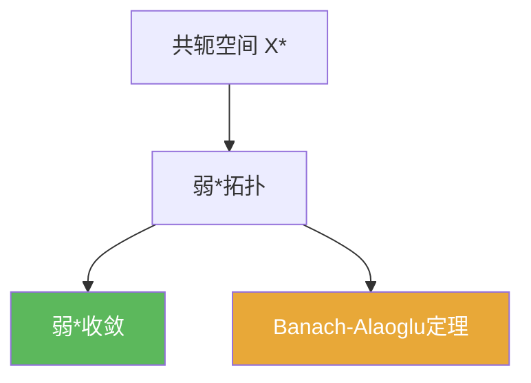

# 弱*收敛

> [!abstract] 概述
> ==弱*收敛==发生在对偶空间 $X^\*$ 上：把 $f_n\in X^\*$ 看作对 $X$ 的逐点函数，$f_n\overset{w^\*}{\to}f$ 指对每个 $x\in X$ 都有 $f_n(x)\to f(x)$。  
> 弱*拓扑的最大价值是 Banach–Alaoglu：对偶单位球在弱*拓扑下紧。

## 定义

> [!def] 定义
> 在 $X^\*$ 中，称 $f_n$ 弱*收敛到 $f$，若对任意 $x\in X$，
> $$f_n(x)\to f(x).$$

## 核心性质（命题工具箱）

| 性质/命题 | 表述（可直接引用） | 用途（做题时怎么用） |
|------|------|------|
| 测试集合不同 | 弱收敛在 $X$ 上用 $X^*$ 测试；弱*收敛在 $X^*$ 上用 $X$ 测试 | 记住“谁在测试谁”，避免把弱与弱*混用 |
| Banach–Alaoglu | 对偶闭单位球 $B_{X^*}$ 在弱*拓扑下紧 | 这是弱*拓扑的核心价值：提供紧性与子列抽取 |
| 与自反性的关系 | 若 $X$ 自反，则弱与弱*在某些集合上更接近 | 证明中需严格按条件使用（见 [[自反空间]]) |

## 典型例子与非例子

| 类型 | 例子 | 提醒 |
|---|---|---|
| 典型 | $X=\ell^1$，则 $X^*=\ell^\infty$；弱*收敛就是对每个 $x\in\ell^1$ 的逐点收敛 | “逐点收敛”直觉来自测试集合是 $X$ |
| 非例子提醒 | 弱*收敛一般不等于范数收敛 | 弱*拓扑更弱，信息更少；结论要谨慎 |

## 关系网络

## 章节扩展

### 第02章：线性算子与线性泛函

- 2.5：定义弱*收敛并用于紧性抽取：[[2.5 共轭空间 弱收敛 自反空间#二、核心思想]]

## 补充

> [!info] 常见误区与来源
>
> - 误区：把弱*收敛当作“在 $X^*$ 的弱收敛”。二者测试集合不同（$X$ vs $X^{**}$），拓扑也不同。  
> - 误区：看到“单位球紧”就以为范数下紧。Banach–Alaoglu 的紧性是弱*拓扑意义下的。
>
> **参考（权威外链）**
> - https://www.imo.universite-paris-saclay.fr/~joseph.feneuil/Cours/Functional_Analysis.pdf  
> - https://en.wikipedia.org/wiki/Banach%E2%80%93Alaoglu_theorem

## 参见

- [[Banach-Alaoglu定理]]
- [[共轭空间]]
