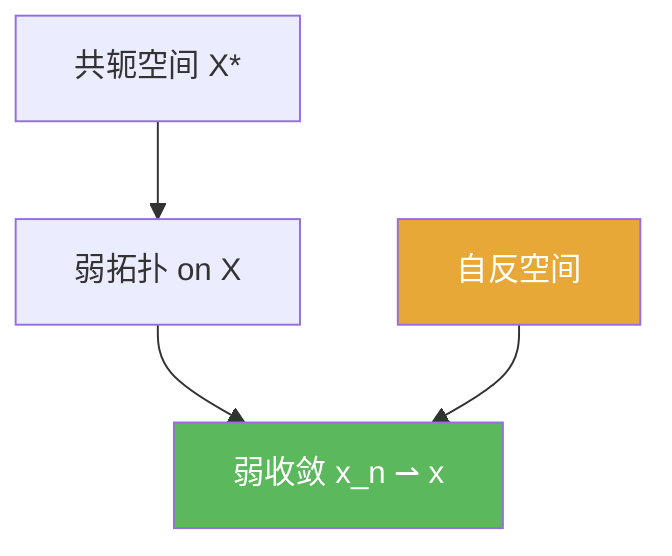

# 弱收敛

> [!abstract] 概述
> ==弱收敛==用“所有对偶泛函的取值”来定义收敛：$x_n\rightharpoonup x$ 当且仅当对所有 $f\in X^\*$ 都有 $f(x_n)\to f(x)$。它比范数收敛弱，但更容易获得紧性与抽取子列。

## 定义

> [!def] 定义
> 在赋范空间 $X$ 中，称 $x_n$ 弱收敛到 $x$（记 $x_n\rightharpoonup x$），若对任意 $f\in X^\*$，
> $$f(x_n)\to f(x).$$

## 核心性质（命题工具箱）

| 性质/命题 | 表述（可直接引用） | 用途（做题时怎么用） |
|------|------|------|
| 强 $\Rightarrow$ 弱 | 若 $\|x_n-x\|\to 0$，则 $x_n\rightharpoonup x$ | 想证明“弱收敛”时，有时可先证明更强的范数收敛 |
| 弱收敛必有界 | $x_n\rightharpoonup x \Rightarrow \sup_n\|x_n\|<\infty$ | 先检查有界性：无界则不可能弱收敛 |
| 自反空间抽取 | 自反空间中有界序列更容易抽取弱收敛子列 | 处理“存在弱极限点”的常用环境（见 [[自反空间]]) |

## 典型例子与非例子

| 类型 | 例子 | 提醒 |
|---|---|---|
| 典型 | Hilbert 中有界正交序列弱收敛到 0 | 很多“强不收敛但弱收敛”的现象来自正交性 |
| 非例子提醒 | 弱收敛一般不推出范数收敛 | 无限维里弱收敛比强收敛弱很多，做题要警惕“误用强结论” |

## 关系网络

## 章节扩展

### 第02章：线性算子与线性泛函

- 2.5：弱/弱*拓扑与自反空间的基本性质：[[2.5 共轭空间 弱收敛 自反空间#二、核心思想]]

## 补充

> [!info] 常见误区与来源
>
> - 误区：把“对每个 $f$ 都收敛”误读为“在 $X$ 里就收敛”。弱收敛是通过对偶测试定义的拓扑收敛，强度不同。  
> - 误区：默认“有界序列一定有弱收敛子列”。这需要额外条件（典型是自反性/弱紧性工具）。
>
> **参考（权威外链）**
> - https://courses.maths.ox.ac.uk/pluginfile.php/83506/mod_resource/content/0/B4.2Lecture10P.pdf  
> - https://www.imo.universite-paris-saclay.fr/~joseph.feneuil/Cours/Functional_Analysis.pdf

## 参见

- [[共轭空间]]
- [[弱*收敛]]
- [[自反空间]]
