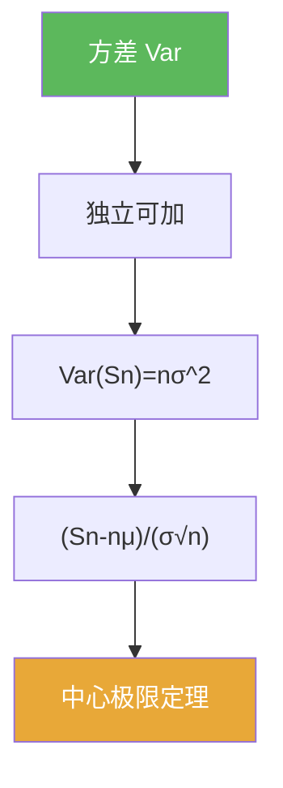

# 方差

> [!abstract] 概述
> ==方差==刻画随机变量的“典型波动大小”。  
> 在本章中，独立情形下方差的可加性给出 $\mathrm{Var}(S_n)=O(n)$，从而解释中心极限定理的自然尺度是 $\sqrt n$。

## 定义

> [!def] 方差
> 若 $X$ 二阶可积（$\mathbb E[X^2]<\infty$），定义
> $$\mathrm{Var}(X)=\mathbb E[(X-\mathbb E[X])^2]=\mathbb E[X^2]-\mathbb E[X]^2.$$

## 核心性质（命题工具箱）

| 性质/命题 | 表述（可直接引用） | 用途（做题时怎么用） |
|---|---|---|
| 平移不变 | $\mathrm{Var}(X+c)=\mathrm{Var}(X)$ | 只关心波动，不关心均值 |
| 缩放 | $\mathrm{Var}(aX)=a^2\mathrm{Var}(X)$ | 标准化时确定除以什么 |
| 独立可加 | 独立且二阶矩存在：$\mathrm{Var}(\sum X_k)=\sum\mathrm{Var}(X_k)$ | 推出 $\sqrt n$ 尺度 |

## 关系网络

## 章节扩展

### 第05章：概率论基础

- 5.1：Bernoulli 模型下的方差：[[5.1 Bernoulli试验#二、核心思想]]
- 5.2：部分和的标准化尺度：[[5.2 独立随机变量的和#二、核心思想]]

## 补充

> [!info] 常见误区
> 方差可加并不总成立：没有独立性（或至少不相关性）时会出现协方差项，需要额外控制。
>
> **参考（权威外链）**
> - https://en.wikipedia.org/wiki/Variance

## 参见

- [[期望]]
- [[独立性]]
- [[中心极限定理]]

