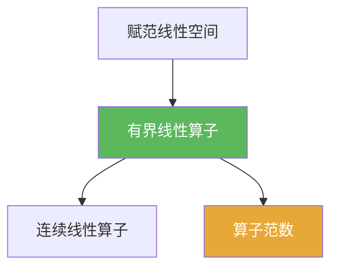

# 有界线性算子

> [!abstract] 概述
> 在赋范空间中，“连续线性算子”与“有界线性算子”是同一个概念：只要能被 $\|Tx\|\le C\|x\|$ 控制，就自动连续。  
> 这条等价把大量 $\varepsilon$–$\delta$ 证明，转化为“找一个全局常数 $C$ 的估计”，是第二章算子论的基本工作方式。

## 定义

> [!def] 定义
> 设 $X,Y$ 为赋范线性空间。线性算子 $T:X\to Y$ 若存在常数 $C>0$ 使得对任意 $x\in X$：
> $$\|Tx\|\le C\|x\|,$$
> 则称 $T$ 为有界线性算子。

## 核心性质（命题工具箱）

| 性质/命题 | 表述（可直接引用） | 用途（做题时怎么用） |
|------|------|------|
| 连续 $\Leftrightarrow$ 有界 | 在线性算子上：$T$ 连续 $\iff \exists C:\ \|Tx\|\le C\|x\|$ | 证明连续：找 $C$；否定连续：构造使比值爆炸的序列 |
| 算子范数刻画 | $\|T\|=\sup_{\|x\|\le 1}\|Tx\|$，且是最小的可行常数 $C$ | 把“最佳常数”数值化（见 [[算子范数]]) |
| 复合次乘性 | $\|ST\|\le \|S\|\|T\|$ | 估计迭代/幂次/级数（如 Neumann 级数）常用 |

## 典型例子与非例子

| 类型 | 例子 | 提醒 |
|---|---|---|
| 有界 | $\mathbb{R}^n$ 上任何线性算子 | 有限维中线性算子自动连续有界 |
| 有界 | 积分算子 $Tf(x)=\int_0^1 k(x,y)f(y)\,dy$（在合适范数下） | 常用“核的估计”给出 $\|T\|$ 上界 |
| 非例子 | $C^1([0,1])\to C([0,1])$ 的导数算子 $f\mapsto f'$（配上某些范数） | 在不恰当的范数下可能不有界，提醒“范数选择很关键” |

## 关系网络

## 章节扩展

### 第01章：度量空间

- 1.4：连续 ⇔ 有界（线性算子）是本章的重要桥梁：[[1.4 赋范线性空间#二、核心思想]]

### 第02章：线性算子与线性泛函

- 2.1：把“连续 ⇔ 有界”作为算子论的起点，并系统引入算子范数：[[2.1 线性算子的概念#二、核心思想]]
- 2.3：开映射/有界逆/闭图像等定理，都以“有界线性算子”作为讨论对象：[[2.3 纲与开映射定理#二、核心思想]]

### 第03章：紧算子与Fredholm算子

- 3.1：紧算子是有界线性算子的子类：[[3.1 紧算子的定义和基本性质#二、核心思想]]
- 3.6：Fredholm 算子以有界线性算子为背景对象：[[3.6 Fredholm算子#二、核心思想]]

## 补充

> [!info] 常见误区与来源
>
> - 误区：“线性算子连续”需要在每点单独验证。对线性算子，只需验证在 0 点连续，且等价于一个全局有界估计。  
> - 误区：把“算子有界”当作“像集有界”。这里的“有界”指算子范数有限。
>
> **参考（权威外链）**
> - ETSU Notes: Bounded Linear Operators: https://faculty.etsu.edu/gardnerr/Func/notes/2-4.pdf

## 参见

- [[Banach空间]]
- [[赋范线性空间]]
