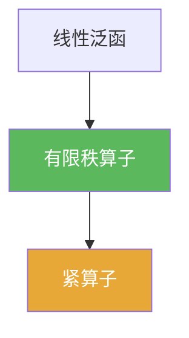

# 有限秩算子

> [!abstract] 概述
> ==有限秩算子==的像空间是有限维的。  
> 它是紧算子最重要的“可构造子类”：有限秩 $\Rightarrow$ 紧，并且很多紧性证明会通过“用有限秩逼近”来完成。

## 定义

> [!def] 有限秩算子
> 线性算子 $T:X\to Y$ 称为有限秩，若 $\operatorname{Ran}T$ 为有限维子空间（等价于 $\operatorname{rank}T<\infty$）。

## 核心性质（命题工具箱）

| 性质/命题 | 表述（可直接引用） | 用途（做题时怎么用） |
|------|------|------|
| 有限秩必紧 | 若 $\operatorname{rank}T<\infty$，则 $T$ 为紧算子 | 证明紧性最常用的“模板结论” |
| 结构表示 | 可写成有限和 $Tx=\sum_{k=1}^n f_k(x)\,y_k$（$f_k$ 线性泛函） | 构造与估计算子范数，连接对偶空间 |
| 稳定性 | 有限秩算子空间在线性组合下封闭 | 便于做逼近与扰动分析 |

## 典型例子与非例子

| 类型 | 例子 | 提醒 |
|---|---|---|
| 典型 | 投影到有限维子空间 | 最直观的有限秩算子 |
| 典型 | $Tx=f(x)\,y$（秩 1） | 由一个泛函与一个向量生成 |
| 非例子 | 恒等算子（在无限维上） | 像空间无限维，故非有限秩 |

## 关系网络

## 章节扩展

### 第03章：紧算子与Fredholm算子

- 3.1：有限秩算子是紧算子的基本例子：[[3.1 紧算子的定义和基本性质#二、核心思想]]

## 补充

> [!info] 来源
> - Wikipedia: Finite-rank operator: https://en.wikipedia.org/wiki/Finite-rank_operator

## 参见

- [[紧算子]]
- [[线性泛函]]
